# 如影智能工作平台：产品战略与顶层设计

**Ruyin Intelligent Work Platform**  
**Vxture SaaS 产品的本地智能工作环境**

> 版本：v0.3  
> 状态：持续讨论与演进  
> 本版修订：明确 Cloud 与 Ruyin Local 是统一工作空间运行时规范的两个实现，差异仅在数据面（用户数据是否上传）

---

## 文档说明

本文件是 Ruyin（如影智能工作平台）的产品战略与顶层设计母文档。

当前版本用于沉淀已经形成的核心共识，同时明确仍需继续讨论和验证的产品问题。

| 状态 | 含义 |
|---|---|
| **已确定** | 已经形成明确共识，可作为后续设计基础 |
| **当前建议** | 基于现阶段分析提出的方向性方案，后续可调整 |
| **待讨论** | 尚未形成最终结论，不应过早固化为产品约束 |

---

# 1. Executive Summary

## 1.1 产品定义

> **Ruyin（如影）是 Vxture SaaS 产品的本地智能工作环境。**

Vxture SaaS 负责：

- 构建业务产品
- 发布 SaaS 产品
- 提供产品订阅
- 持续提供云端业务能力

Ruyin 负责：

- 提供本地工作环境
- 连接本地文件与数据
- 连接局域网和私有服务
- 调用 Vxture 云端能力
- 产生本地工作成果
- 由用户控制数据是否同步到云端

```text
Vxture SaaS 产品订阅
        ↓
┌─────────────────────┐
│   Cloud Workspace   │
│         +           │
│   Ruyin Local       │
│   Workspace         │
└─────────────────────┘
```

---

## 1.2 核心产品关系

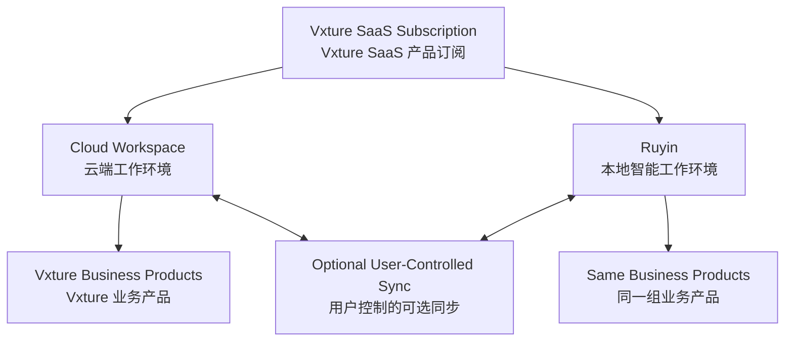

> **产品属于 Vxture SaaS，工作环境可以是 Cloud 或 Ruyin。**

---

## 1.3 长期与近期定位

### 长期定位

> **Ruyin 是 Vxture 的 AI 原生业务工作平台。**

### 近期定位

> **先解决 Vxture SaaS 产品的本地化使用问题。**

也就是说，Ruyin 近期不是重新建设一套 CRM、标书、文档等业务产品，而是让这些 Vxture SaaS 产品能够进入用户的本地工作环境。

---

## 1.4 产品发展路径

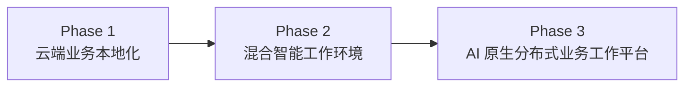

### Phase 1：Cloud-Connected Local Workspace

> 云端业务能力，本地可用。

### Phase 2：Hybrid Intelligent Workspace

> 云端能力与本地数据、工具、记忆和部分智能能力深度融合。

### Phase 3：AI-Native Distributed Work Environment

> 形成云端、本地、私有环境协同的 AI 原生业务工作平台。

# 2. Product Positioning

## 2.1 Ruyin 是什么

Ruyin 是 **Vxture SaaS 产品的本地智能工作环境**。

```text
Vxture SaaS
    │
    ├── 客户销售
    ├── 标书编写
    ├── 文档编写
    └── 更多 AI 原生业务产品
             │
             ▼
        Cloud Workspace
             +
        Ruyin Local Workspace
```

Ruyin 不重新定义业务产品，而是解决：

> **同一个业务产品，如何在云端和本地环境中连续工作。**

---

## 2.2 核心价值链

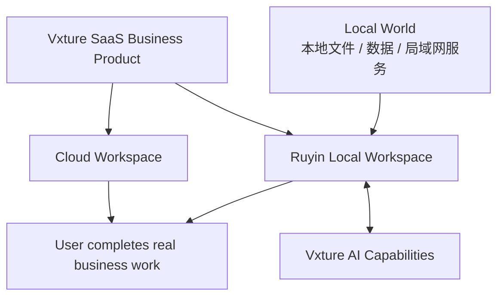

核心价值：

> **Vxture 提供产品，Ruyin 提供本地工作环境，用户控制数据是否同步。**

---

## 2.3 Ruyin 不是什么

Ruyin 不是：

- ❌ CRM、标书、文档等业务产品的集合
- ❌ SaaS 产品的简单桌面镜像
- ❌ SaaS 产品的离线缓存
- ❌ 将 SaaS 产品完整复制到本地
- ❌ 仅仅把本地文件上传到云端的工具
- ❌ 一个以 Agent 为中心的 AI 工具箱

Ruyin 是：

> **Vxture SaaS 产品的另一种工作环境。**

---

## 2.4 核心产品定义

> **Vxture 构建智能能力，业务产品承载业务逻辑，Ruyin 组织本地智能工作。**

```text
Vxture AI Infrastructure
          ↓
Vxture SaaS Business Products
          ↓
Cloud Workspace + Ruyin Local Workspace
          ↓
User completes real work
```

# 3. Industry Product Strategy

## 3.1 行业级产品方向

Ruyin 的长期产品组织方式趋向于“大行业”，而不是单一工具。

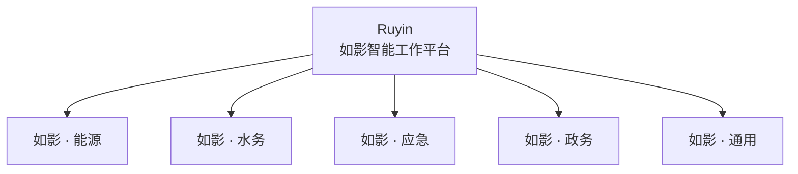

---

## 3.2 行业不是主题皮肤

行业产品不应只是：

- Logo 不同
- 颜色不同
- 首页不同

而应该包含完整的行业业务体系：

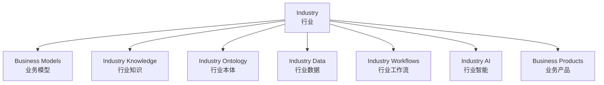

---

## 3.3 行业与业务产品

例如：

```text
如影 · 能源
│
├── 客户关系管理
├── 项目投标
├── 能源数据分析
├── 经营分析
└── AI 决策
```

```text
如影 · 水务
│
├── 水务项目管理
├── 水情分析
├── 应急处置
├── 客户管理
└── 经营分析
```

```text
如影 · 应急
│
├── 事件管理
├── 轨迹分析
├── 指挥调度
├── 预案管理
└── 复盘分析
```

---

# 4. Product Philosophy

## 4.1 业务优先，而不是 AI 优先

用户不是为了使用 AI 而进入 Ruyin。

用户是为了：

- 管理客户
- 推进销售
- 编写标书
- 分析轨迹
- 处理应急事件
- 完成项目
- 经营企业

而进入 Ruyin。

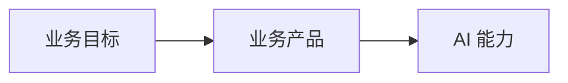

核心原则：

> **AI 服务于业务目标。**

---

## 4.2 AI 是业务智能层

AI 不一定必须以 Agent 的形式出现。

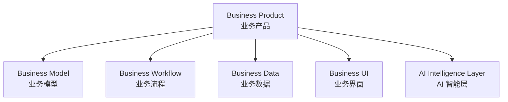

AI 可以以不同方式存在：

| AI 形态 | 说明 |
|---|---|
| 显式交互 | 用户主动请求 AI 分析、生成和建议 |
| 隐式智能 | AI 在后台分析业务数据 |
| 主动智能 | AI 根据业务状态主动提醒 |
| 自动智能 | AI 在授权范围内自动执行部分业务流程 |

> **Agent 是实现方式，不是产品本质。**

---

## 4.3 业务产品不应被 Agent 化

错误模型：

```text
Agent
  ↓
替代 CRM
```

正确模型：

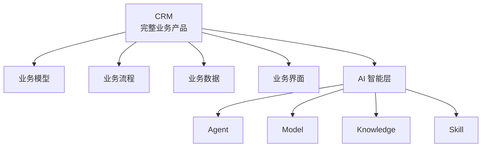

CRM 仍然是 CRM。

AI 是 CRM 的智能层。

---

## 4.4 Vxture 构建智能能力，Ruyin 组织智能工作

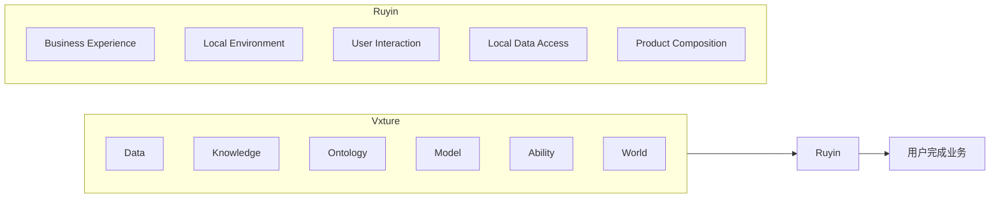

---

## 4.5 数据来源与数据存储分离

这是 Ruyin 的重要基础原则。

### 数据来源

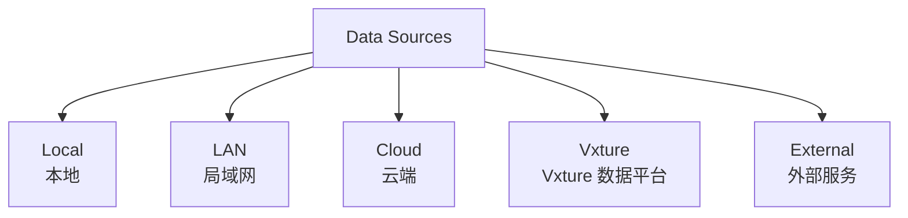

### 数据存储

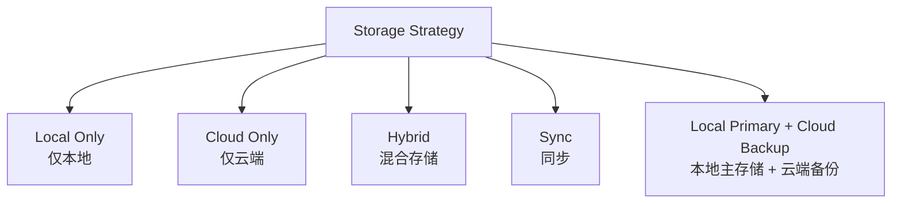

> **数据来源与数据最终存储位置不是同一个问题。**

---

# 5. Top-Level Product Architecture

## 5.1 产品关系总架构

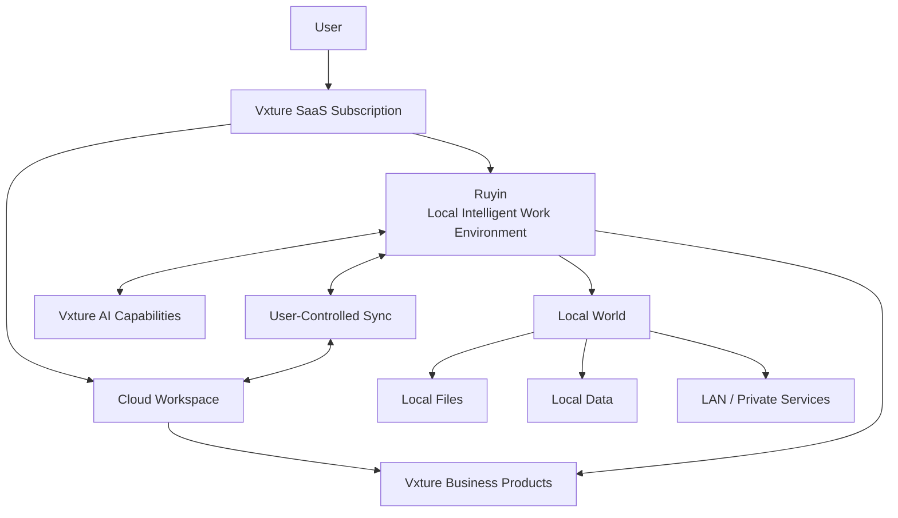

---

## 5.2 逻辑分层

### L1 · Business Product Layer

由 Vxture SaaS 构建和提供：

```text
客户销售
标书编写
文档编写
经营分析
...
```

业务产品拥有自己的：

- 业务模型
- 业务流程
- 业务数据
- 产品界面
- AI 智能层

---

### L2 · Work Environment Layer

```text
Cloud Workspace
        +
Ruyin Local Workspace
```

同一个 SaaS 产品可以在两种工作环境中使用。

两种工作环境由同一套 Workspace Runtime 规范与同一份 Runtime Contract 支撑：

```text
Workspace Runtime 规范（统一）
   ├── Vxture Cloud Runtime → Cloud Workspace
   └── Ruyin Local Runtime → Ruyin Local Workspace
```

业务语义与智能能力（当前均为云端 AI）保持一致，
差异仅在数据面：用户数据是否上传。

---

### L3 · Local Context Layer

Ruyin 提供本地上下文：

- 本地文件
- 本地数据
- 局域网数据
- 本地应用
- 本地服务

---

### L4 · AI Capability Layer

业务产品和 Ruyin 可以调用 Vxture 的：

```text
Model
Agent
Knowledge
Skill / Ability
Ontology
Data
World
```

---

### L5 · Sync & Data Control Layer

负责：

- 本地数据控制
- 云端同步
- 同步授权
- 同步范围
- 同步方向
- 冲突处理

# 6. Business Product Model

## 6.1 不同业务拥有不同业务内核

Ruyin 不以统一的 Project 作为所有业务的顶层容器。

不同业务拥有不同的组织方式。

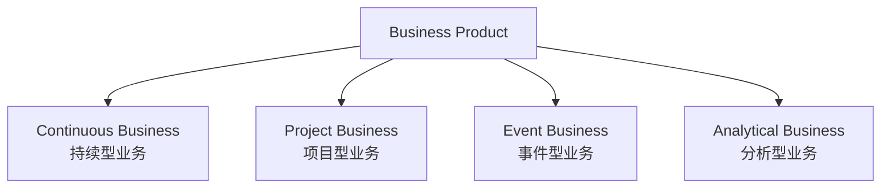

---

## 6.2 CRM：持续型业务系统

CRM 的核心不是 Project，而是客户生命周期。

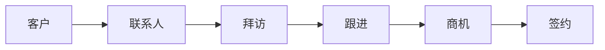

CRM 的核心业务对象：

- 客户
- 联系人
- 拜访
- 沟通与跟进
- 商机
- 合同
- 客户分析
- 销售计划

AI 可以作为 CRM 的智能层：

- 客户分析
- 跟进问题识别
- 商机预测
- 销售建议
- 销售教练
- 自动提醒

---

## 6.3 标书编写：项目型业务系统

标书编写的核心组织结构是 Project。

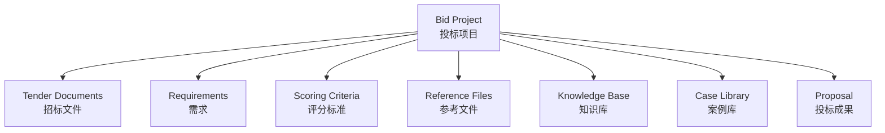

一个投标项目结束后：

```text
投标项目
   ↓
项目结束
   ↓
资料沉淀
   ↓
案例 / 知识资产
```

---

## 6.4 Business Product 通用模型

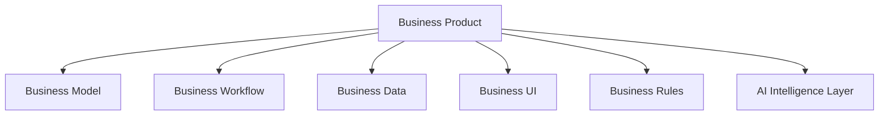

---

# 7. Local / Cloud Product Model

## 7.1 Cloud Workspace

```text
用户
 ↓
Vxture SaaS
 ↓
业务产品
 ↓
云端数据 / 云端生成物
```

适合：

- 多设备访问
- 团队协作
- 云端数据管理
- 云端知识库
- 长期业务沉淀

---

## 7.2 Ruyin Local Workspace

```text
用户
 ↓
Ruyin
 ↓
同一个 Vxture 业务产品
 ↓
本地文件 / 本地数据 / 局域网服务
 ↓
Vxture 云端 AI 能力
 ↓
本地生成物
```

关键原则：

> **本地使用不等于先上传，再下载。**

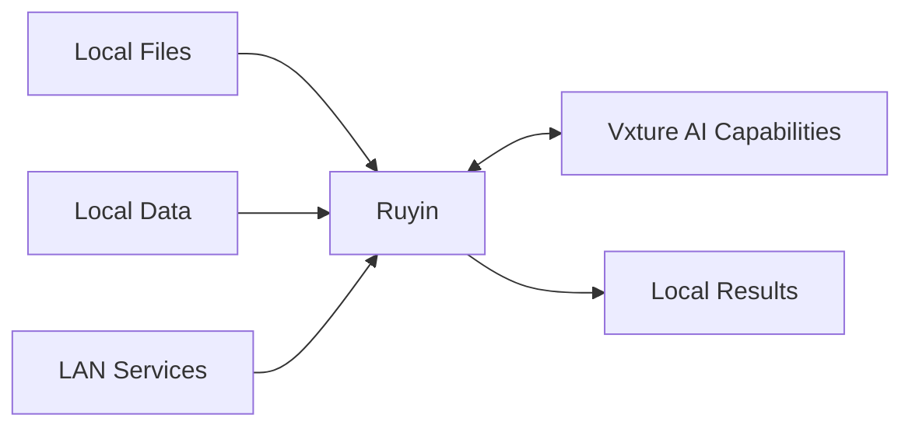

---

## 7.3 同步不是默认行为

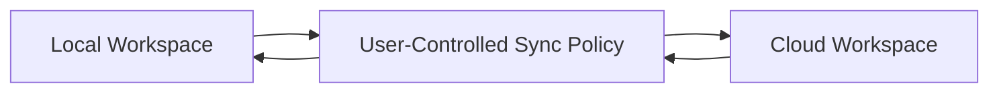

同步可以按以下粒度控制：

- 文件
- 项目
- 知识库
- 文档
- 附件
- 业务成果
- 配置

---

## 7.4 典型同步模式

### 模式 A：全部本地

```text
本地资料 → Ruyin → 云端 AI 能力 → 本地生成物
```

云端不保存业务资料和成果。

> 说明：当前模型统一调用云端，推理时的上下文传输是临时、非持久、可审计的。
> "不保存"指云端不持久化存储任何业务资料与成果（推理传输 ≠ 数据存储）。

### 模式 B：本地工作，成果同步

```text
本地资料 → Ruyin → 本地生成物 → 用户选择 → 云端
```

### 模式 C：本地工作，知识同步

```text
本地知识库 → 用户选择 → 云端知识库
```

### 模式 D：云端与本地协同

```text
Cloud Workspace
        ⇄
User-Controlled Sync
        ⇄
Ruyin Local Workspace
```

---

## 7.5 典型项目数据示例

```text
投标项目 A
│
├── 招标文件
│   └── 仅本地
│
├── 企业内部资料
│   └── 仅本地
│
├── AI 分析结果
│   └── 仅本地
│
├── 最终投标文件
│   └── 用户选择同步
│
└── 项目总结
    └── 同步云端
```

# 8. Product Evolution Roadmap

## Phase 1 · Cloud-Connected Local Workspace

目标：

> **让 Vxture SaaS 产品可以在 Ruyin 本地工作环境中使用。**

重点：

- Ruyin 本地运行环境
- 本地文件访问
- 本地数据访问
- 局域网连接器
- 云端 AI 能力调用
- 本地生成物
- 基础同步

---

## Phase 2 · Hybrid Intelligent Workspace

目标：

> **云端产品与本地工作环境深度协同。**

增加：

- 更细粒度同步
- 本地索引
- 本地缓存
- 本地记忆
- 更丰富的连接器
- 企业私有网络支持
- 更完整的数据策略

---

## Phase 3 · AI-Native Distributed Work Environment

目标：

> **形成云端、本地、私有环境协同的 AI 原生业务工作平台。**

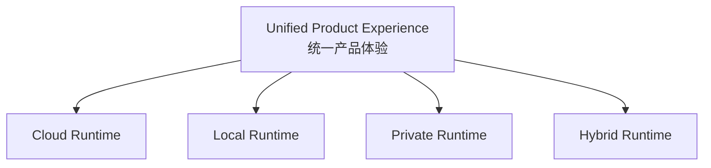

核心目标：

> **体验统一，数据控制权在用户，智能能力可以来自云端、本地或私有环境。**

# 9. Current Decisions & Open Questions

## 9.1 当前已形成共识

1. 业务产品属于 Vxture SaaS。
2. Ruyin 不重新定义 CRM、标书、文档等业务产品。
3. Ruyin 是 Vxture SaaS 产品的本地智能工作环境。
4. 同一个 SaaS 产品可以在 Cloud Workspace 和 Ruyin Local Workspace 中使用。
5. 本地工作不等于上传本地资料后再处理。
6. 本地数据可以直接参与工作，并生成本地成果。
7. 云端 AI 能力可以服务本地工作。
8. 同步不是默认行为，而是用户控制的数据流动。
9. 同步可以按项目、知识库、文档、成果等不同粒度进行。
10. 第一阶段优先解决 SaaS 产品的本地化使用问题。
11. 不急于复制完整 Vxture 到本地。
12. Cloud 与 Ruyin Local 是同一套统一工作空间运行时规范的两个对等实现，由同一份 Runtime Contract 保证业务连续性。
13. 智能面统一：AI 能力当前一律调用 Vxture 云端；推理传输是临时数据流动，不等于数据存储。

---

## 9.2 下一阶段需要重点研究的问题

### 1. Ruyin 如何加载 SaaS 产品？

```text
Vxture SaaS Subscription
        ↓
Ruyin
        ↓
Available Products
```

### 2. SaaS 产品如何调用本地数据？

```text
Business Product
        ↓
Ruyin Local Context
        ↓
Local Files / Data / Services
```

### 3. 云端 AI 如何处理本地工作？

```text
Local Context
        ↓
Ruyin
        ↓
Vxture AI
        ↓
Local Result
```

> 部分回答：见 02 文档 §15.2「推理传输 ≠ 数据存储」；
> 上下文最小化选择与审计机制仍待 04《Context Architecture》设计。

### 4. 用户如何控制同步？

```text
Local Data
        ↓
User Decision
        ↓
Cloud Sync
```

### 5. 本地与云端如何保持产品连续性？

```text
Cloud Workspace
        ⇄
User-Controlled Sync
        ⇄
Ruyin Local Workspace
```

> 已回答：见 02 文档 §15 统一运行时模型 ——
> 同一份 Runtime Contract + 同一套运行时规范（Runtime Conformance）+ Workspace 级用户控制同步。

# 10. Guiding Principles

1. **业务产品属于 Vxture SaaS。**
2. **Ruyin 提供本地工作环境，而不是重新建设一套业务产品。**
3. **同一个 SaaS 产品应尽可能保持云端与本地的业务连续性。**
4. **本地数据不必默认上传云端。**
5. **云端 AI 能力可以服务本地工作。**
6. **同步是用户控制的数据流动。**
7. **数据同步应支持项目、知识、文档、成果等不同粒度。**
8. **Ruyin 的核心价值是工作环境与数据控制，而不是业务产品分类。**
9. **第一阶段先把云端产品的本地化工作环境做好。**
10. **复杂的本地 AI、离线智能和完整私有化能力逐步演进。**

# 11. 下一步设计重点

下一步不继续讨论：

> Ruyin 自己要做哪些业务产品？

这属于 Vxture SaaS 产品规划。

下一步应重点进入 Ruyin 的产品与技术设计：

1. **Ruyin 如何加载和运行 Vxture SaaS 产品？**
2. **业务产品如何发现和调用本地文件、数据与服务？**
3. **本地数据如何安全地参与云端 AI 推理？**
4. **哪些数据可以被发送到云端，如何由用户控制？**
5. **项目、知识库、文档和成果如何分别同步？**
6. **云端与本地如何实现连续的业务体验？**
7. **Ruyin 本地运行时的权限、安全和生命周期如何设计？**

> **下一阶段的核心不是设计更多业务产品，而是设计 Ruyin 作为 Vxture SaaS 本地工作环境的产品架构。**

---

> **本文档为 Ruyin 产品战略与顶层设计 v0.3，后续持续演进。**
