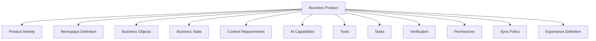
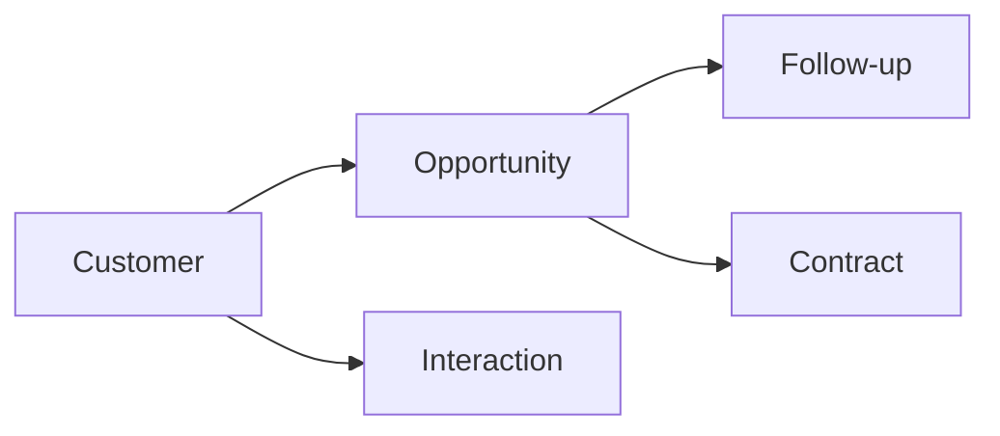
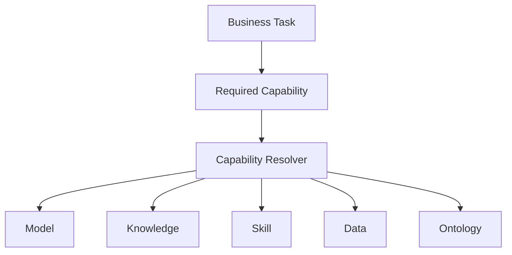
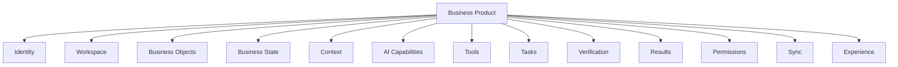
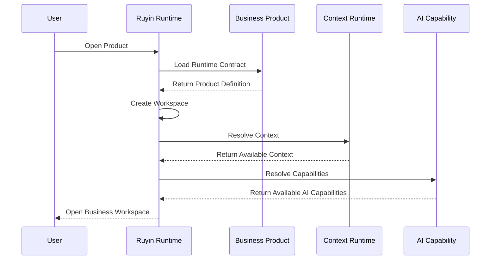
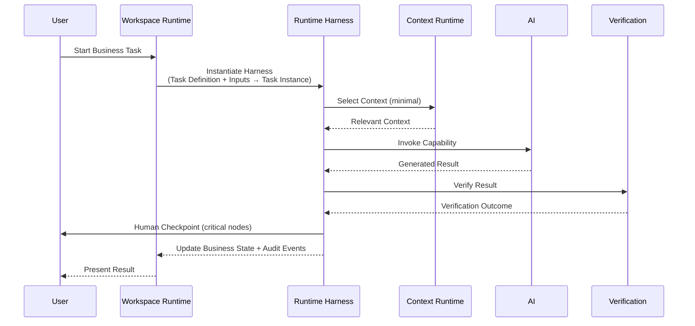
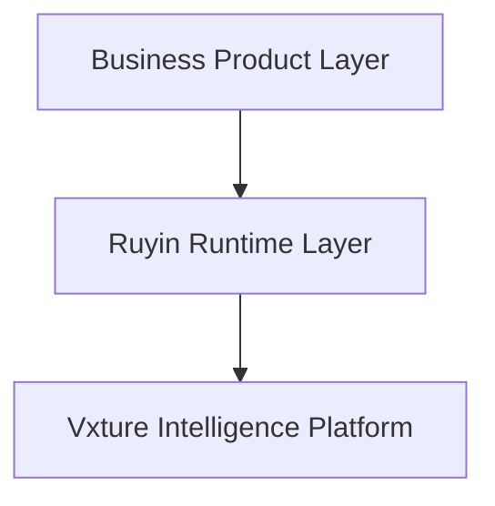

# 如影 Runtime Contract：AI 原生业务产品运行时契约设计

> **Ruyin Business Product Runtime Contract**
>
> 文档版本：v0.3  
> 文档状态：架构设计基线  
> 所属平台：Vxture Platform  
> 关联文档：02 Workspace Runtime Architecture  
> 本版修订：任务契约明确为 Task Definition（静态声明）；运行期 Task Instance 由 Harness 实例化，不出现在契约中
> 上版修订：契约面向统一运行时（Cloud / Local 两个实现），新增 Same Contract, Any Runtime 原则

---

# 1. 文档定位

本文件定义：

> **一个 Vxture AI 原生业务产品，如何被 Ruyin Workspace Runtime 识别、加载、运行和管理。**

上一份文档定义了：

```text
Business Product
        ↓
Business Workspace
        ↓
Workspace Runtime
```

本文件进一步回答：

> **Business Product 与 Workspace Runtime 之间，究竟通过什么契约连接？**

核心结论：

```text
Vxture Business Product
        ↓
Runtime Contract（同一份契约）
        ↓
Workspace Runtime 规范
   ├── Vxture Cloud Runtime
   └── Ruyin Local Runtime
        ↓
Business Workspace
```

Runtime Contract 是：

> **业务产品进入统一工作空间运行时（云端与本地）的标准化描述与运行协议。**

同一个业务产品（如标书编写）既可以在 Cloud Runtime 中完成，
也可以在 Ruyin Local Runtime 中完成。
契约在两个运行时中语义一致，差异仅在数据面：用户数据是否上传。

---

# 2. 为什么需要 Runtime Contract

## 2.1 没有契约会发生什么

如果每个产品独立适配 Ruyin：

```text
CRM ─────────────┐
                 ├── Ruyin
Bid ─────────────┤
                 │
Document ────────┘
```

每个产品都需要独立实现：

- 本地运行逻辑
- 数据连接
- AI 调用
- 权限
- 同步
- Workspace
- 状态管理

最终：

```text
产品数量增加
    ↓
适配成本线性甚至指数增长
```

---

## 2.2 有 Runtime Contract

```text
CRM
 │
 ├── Runtime Contract
 │
Bid
 │
 ├── Runtime Contract
 │
Document
 │
 └── Runtime Contract
        ↓
Ruyin Runtime
```

Ruyin 提供统一能力：

```text
Workspace
Context
AI
Tools
Permission
State
Sync
Audit
```

业务产品只需要声明：

```text
我是什么业务
我需要什么环境
我能做什么
我产生什么结果
```

---

# 3. Runtime Contract 的核心定位

Runtime Contract 不是：

- API 文档
- SDK 文档
- UI 配置文件
- Agent Prompt
- 单纯的 Manifest
- 单纯的插件协议

它是：

> **业务产品与工作空间运行时之间的业务运行协议。**

---

# 4. Contract 的核心组成



---

# 5. Product Identity

每个业务产品首先需要定义自己的身份。

```text
Product Identity
    ├── Product ID
    ├── Product Name
    ├── Version
    ├── Publisher
    ├── Required Runtime
    └── Capabilities
```

示例：

```yaml
product:
  id: bid
  name: Bid Intelligence
  version: 1.0.0
  runtime:
    minimum: 0.1.0
```

核心原则：

> **Ruyin 运行时不关心产品内部如何实现，只关心产品声明的运行能力。**

---

# 6. Workspace Definition

业务产品必须声明：

> **用户进入这个产品后，究竟进入什么类型的工作空间。**

示例：

```yaml
workspace:
  type: project
  lifecycle: finite
  supports:
    - create
    - open
    - archive
    - restore
```

CRM：

```yaml
workspace:
  type: persistent
  lifecycle: continuous
```

文档：

```yaml
workspace:
  type: document
  lifecycle: versioned
```

---

# 7. Workspace Type

建议第一阶段支持：

```text
persistent
project
document
```

未来：

```text
case
campaign
operation
research
decision
incident
```

核心原则：

> **Ruyin 提供 Workspace Runtime，业务产品定义 Workspace Type。**

---

# 8. Business Object Contract

Workspace 不是空壳。

业务产品必须声明：

```text
Business Objects
```

例如 CRM：

```text
Customer
Contact
Opportunity
Interaction
Follow-up
Contract
```

标书：

```text
Bid Project
Tender
Requirement
Proposal
Deliverable
```

文档：

```text
Document
Section
Version
Review
Comment
```

---

## 8.1 Object Relationship



业务对象之间的关系应由业务产品定义。

---

# 9. Business State Contract

每个 Workspace 必须有明确状态。

例如：

```text
Bid Project
    ├── Draft
    ├── Planning
    ├── Writing
    ├── Review
    ├── Submitted
    └── Archived
```

状态定义：

```yaml
state:
  name: review
  transitions:
    - to: writing
    - to: submitted
```

状态转换可以由：

- 用户触发
- AI 建议
- 工作流触发
- 系统事件触发

但关键状态转换必须支持人工确认。

---

# 10. Context Contract

业务产品必须声明：

> **当前业务工作需要什么上下文。**

例如 Bid：

```text
Context
    ├── Tender Documents
    ├── Enterprise Knowledge
    ├── Product Materials
    ├── Case Library
    └── Project Files
```

这些上下文可以来自：

```text
Cloud
Local
LAN
Private System
```

---

## 10.1 Context Requirement

```yaml
context:
  required:
    - tender_document
  optional:
    - enterprise_knowledge
    - case_library
  sources:
    - cloud
    - local
    - lan
```

核心原则：

> **业务产品声明需要什么上下文，Runtime 决定如何获取上下文。**

---

# 11. Context Source

Context Source 统一抽象为：

```text
Context Source
    ├── Cloud Source
    ├── Local Source
    ├── LAN Source
    ├── Private Source
    └── External Source
```

业务产品不应该直接操作本地文件系统。

而是：

```text
Business Product
        ↓
Context Contract
        ↓
Context Runtime
        ↓
Data Source
```

这样可以保持：

```text
业务逻辑
    ≠
数据位置
```

---

# 12. AI Capability Contract

业务产品需要声明：

> **在什么业务场景中需要什么 AI 能力。**

例如：

```text
Bid Product
    ├── Requirement Analysis
    ├── Knowledge Retrieval
    ├── Proposal Generation
    ├── Coverage Verification
    └── Consistency Analysis
```

AI 能力来自：

```text
Model
Knowledge
Skill
Ontology
Data
Agent
```

业务产品不应该绑定某一个具体模型。

错误：

```text
Bid Product
    ↓
GPT-5
```

正确：

```text
Bid Product
    ↓
Requirement Analysis Capability
    ↓
Runtime Capability Resolver
    ↓
Available Model
```

当前阶段的解析结果：

```text
Cloud Runtime ──┐
                ├──→ Vxture 云端 AI 服务
Local Runtime ──┘
```

> **智能面统一：无论运行在云端还是本地，AI 能力当前一律解析到 Vxture 云端。**
> 未来引入本地 / 私有智能能力时，只改变解析结果，不改变契约。

---

# 13. Capability Resolution



核心原则：

> **业务产品声明能力需求，不直接绑定底层智能资源。**

---

# 14. Tool Contract

业务产品可以声明工具：

```text
Tool
    ├── Read File
    ├── Write File
    ├── Search Knowledge
    ├── Query CRM
    ├── Generate Document
    └── Export Result
```

工具必须具备：

```text
Tool
    ├── ID
    ├── Description
    ├── Input Schema
    ├── Output Schema
    ├── Permission
    └── Risk Level
```

---

# 15. Tool Permission

工具不能默认无限制访问。

```text
Tool
    ↓
Permission Check
    ↓
Context Check
    ↓
User Policy
    ↓
Execution
```

例如：

```text
读取本地文件
    └── 允许

删除文件
    └── 必须确认

同步云端
    └── 必须符合用户策略

对外发送
    └── 必须人工确认
```

---

# 16. Task Definition Contract

契约中声明的任务是 **Task Definition（任务定义）** —— 静态模板，随产品发布。

运行期由 Harness 将其与具体输入实例化为 Task Instance（见 02 文档第 9 章）：

```text
Task Definition（契约声明，静态）
        ↓
Harness 实例化（绑定具体输入 + 选定上下文）
        ↓
Task Instance（运行期对象，随任务生灭）
```

业务产品声明：

```text
Task Definition
    ├── Objective
    ├── Input Types
    ├── Output Types
    ├── Constraints
    ├── Required Capabilities
    ├── Allowed Tools
    └── Verification Rules
```

示例：

```yaml
task:
  id: generate_proposal
  objective: generate technical proposal
  input_types:
    - tender_document
    - enterprise_capability
    - case_library
  output_types:
    - technical_proposal
  capabilities:
    - proposal_generation
  tools:
    - search_knowledge
    - read_file
    - write_document
  verification:
    - requirement_coverage
    - consistency_check
```

> **契约只声明 Definition；Instance 是运行时对象，不出现在契约中。**

---

# 17. Verification Contract

业务产品必须声明：

> **什么样的结果才算完成。**

例如：

```text
技术方案生成
    ↓
Requirement Coverage
    ↓
Consistency Check
    ↓
Format Check
    ↓
Human Review
```

验证可以是：

```text
Automated
    +
AI Assisted
    +
Human
```

---

# 18. Result Contract

AI 任务不是返回一段文本就结束。

结果应该是：

```text
Business Result
    ├── Result Type
    ├── Content
    ├── Source
    ├── Status
    ├── Verification
    └── Provenance
```

例如：

```text
Technical Proposal
    ├── Draft
    ├── Generated
    ├── Based on:
    │   ├── Tender Document
    │   ├── Enterprise Data
    │   └── Case Library
    └── Verification:
        ├── Coverage: 96%
        └── Review: Pending
```

---

# 19. Sync Contract

每个业务产品可以声明数据同步策略。

```text
Sync
    ├── Local Only
    ├── Cloud Only
    ├── Bidirectional
    ├── Manual
    └── Selective
```

但：

> **产品可以声明同步能力，用户拥有最终控制权。**

同步策略只约束数据的**持久化存储**位置。
推理时的上下文传输（Inference Transmission）不属于同步范畴：
它是临时、非持久、可审计的数据流动（详见 02 文档 §15.2）。

```text
推理传输 ≠ 数据存储
```

---

## 19.1 Data Classification

建议业务产品对数据进行分类：

```text
Data
    ├── Core Business Data
    ├── Source Data
    ├── Generated Data
    ├── Derived Data
    └── Temporary Data
```

例如：

```text
招标项目
│
├── Source Data
│   └── 招标原文件
│
├── Core Data
│   └── 需求清单
│
├── Generated Data
│   └── 技术方案
│
├── Derived Data
│   └── 需求覆盖分析
│
└── Temporary Data
    └── 中间生成内容
```

不同类型可以拥有不同同步策略。

---

# 20. Permission Contract

权限至少包括：

```text
Workspace Permission
Data Permission
Tool Permission
AI Permission
Sync Permission
System Permission
```

示例：

```text
用户
    ↓
Workspace Permission
    ↓
Context Permission
    ↓
Tool Permission
    ↓
Execution
```

权限模型必须支持：

```text
Allow
Deny
Ask
```

---

# 21. UI Contract

Ruyin 不要求所有产品使用统一 UI。

这是一个重要原则。

```text
Ruyin
    ↓
统一 Runtime
    ↓
不同 Business Product
    ↓
不同 Business UI
```

例如：

### CRM

```text
Dashboard
Customer
Pipeline
Activity
Analysis
```

### Bid

```text
Project
Requirement Matrix
Proposal Editor
Knowledge
Review
```

### Document

```text
Document
Outline
Editor
References
Version
```

因此：

> **统一的是运行时，不是所有产品的界面。**

---

# 22. Runtime Contract 的完整模型



---

# 23. Runtime Loading Process

Ruyin 启动业务产品：



---

# 24. Task Execution Process



任务结束后 Harness 销毁；执行中断时由 Execution State Machine
保留断点，恢复时重建 Harness 续跑（见 02 文档 §8.4）。

---

# 25. Example: CRM Runtime Contract

```text
Product
└── CRM

Workspace
└── Persistent Business Workspace

Business Objects
├── Customer
├── Contact
├── Opportunity
├── Interaction
├── Follow-up
└── Contract

Context
├── Customer Data
├── Interaction History
├── Sales Records
└── External Business Data

AI Capabilities
├── Customer Analysis
├── Opportunity Scoring
├── Follow-up Recommendation
└── Risk Detection

Tasks
├── Analyze Customer
├── Plan Follow-up
├── Review Opportunity
└── Generate Sales Summary

Verification
├── Data Consistency
└── Human Confirmation
```

---

# 26. Example: Bid Runtime Contract

```text
Product
└── Bid Intelligence

Workspace
└── Project Workspace

Business Objects
├── Bid Project
├── Tender
├── Requirement
├── Proposal
└── Deliverable

Context
├── Local Tender Files
├── Cloud Knowledge
├── Enterprise Capability
├── Product Data
└── Case Library

AI Capabilities
├── Requirement Analysis
├── Knowledge Retrieval
├── Proposal Generation
├── Coverage Verification
└── Consistency Analysis

Tasks
├── Analyze Tender
├── Build Requirement Matrix
├── Generate Proposal
├── Review Proposal
└── Export Deliverable

Verification
├── Requirement Coverage
├── Consistency
├── Source Traceability
└── Human Review
```

---

# 27. Example: Document Runtime Contract

```text
Product
└── Document Intelligence

Workspace
└── Document Workspace

Business Objects
├── Document
├── Section
├── Version
├── Reference
└── Review

Context
├── Local Files
├── Cloud Knowledge
├── Templates
└── References

AI Capabilities
├── Outline Generation
├── Content Generation
├── Rewrite
├── Summarization
└── Consistency Check

Tasks
├── Create Document
├── Generate Section
├── Review Document
└── Export Document
```

---

# 28. What Ruyin Owns

Ruyin Runtime owns:

```text
Runtime Lifecycle
Workspace Lifecycle
Context Resolution
Capability Resolution
Tool Permission
Task Execution
State Management
Verification Orchestration
Sync Control
Local System Integration
Audit
Recovery
```

---

# 29. What Business Product Owns

Business Product owns:

```text
Business Domain
Business Objects
Business Workflow
Business Rules
Business UI
Business Tasks
Business Outcomes
Business Verification Definition
```

---

# 30. What Vxture Platform Owns

Vxture Platform owns:

```text
Data
Knowledge
Ontology
Model
Ability
Identity
Subscription
Cloud Infrastructure
AI Services
```

---

# 31. Three-Layer Responsibility Model



### Business Product

```text
What business?
```

### Ruyin Runtime

```text
How does the business work?
```

### Vxture Platform

```text
What intelligence is available?
```

---

# 32. Runtime Contract Design Principles

## Principle 1：Declarative First

业务产品声明：

```text
需要什么
```

而不是：

```text
自己实现所有底层能力
```

---

## Principle 2：Business Semantics First

契约必须优先表达：

```text
业务对象
业务状态
业务任务
业务结果
```

而不是只表达：

```text
API
Function
Tool
```

---

## Principle 3：Environment Agnostic

业务产品不应该绑定：

```text
Cloud
Local
```

业务产品只声明：

```text
Required Context
Required Capability
```

Runtime 决定实际运行环境。

---

## Principle 4：Capability Decoupling

业务产品不绑定具体：

```text
Model
Provider
Infrastructure
```

而绑定：

```text
Capability
```

---

## Principle 5：User-Controlled Data

业务产品不能绕过 Ruyin 的数据控制策略。

---

## Principle 6：Verifiable Result

所有重要业务成果都应支持：

```text
Source
Verification
Review
Provenance
```

---

## Principle 7：Same Contract, Any Runtime

一份契约在所有运行时实现中必须语义一致：

```text
Runtime Contract
    ├── Vxture Cloud Runtime
    └── Ruyin Local Runtime
```

业务产品不感知运行时差异。

运行时实现必须通过一致性验证（Runtime Conformance）。
这是"云端 ↔ 本地业务连续性"的技术抓手。

---

# 33. Recommended Initial Scope

第一阶段不需要实现完整 Contract。

建议只实现：

```text
Product Identity
Workspace Type
Business Objects
Context Requirements
AI Capabilities
Tasks
Sync Policy
Permissions
```

暂不实现复杂：

```text
Dynamic UI Schema
Complex Workflow Engine
Cross-product Workspace
Advanced Recovery
Multi-agent Orchestration
```

---

# 34. MVP Runtime Contract

第一阶段最小模型：

```text
Business Product
│
├── Identity
├── Workspace
├── Context
├── Capabilities
├── Tasks
├── Permissions
└── Sync
```

流程：

```text
Load Product
    ↓
Create Workspace
    ↓
Resolve Context
    ↓
Resolve Capability
    ↓
Execute Task
    ↓
Return Result
    ↓
Apply Sync Policy
```

---

# 35. Final Definition

> **Runtime Contract is the standard business execution contract between Vxture AI-native business products and Ruyin Workspace Runtime.**

中文：

> **Runtime Contract 是 Vxture AI 原生业务产品与 Ruyin Workspace Runtime 之间的标准业务运行契约。**

最终模型：

```text
Business Product
        ↓
Runtime Contract
        ↓
Ruyin Workspace Runtime
        ↓
Business Workspace
        ↓
Business Work
        ↓
Business Result
```

Ruyin 的长期目标不是：

> **让任何 Agent 都能运行。**

而是：

> **让 Vxture 的 AI 原生业务产品能够在云端和用户本地，以统一、可控、可验证的方式运行。**
