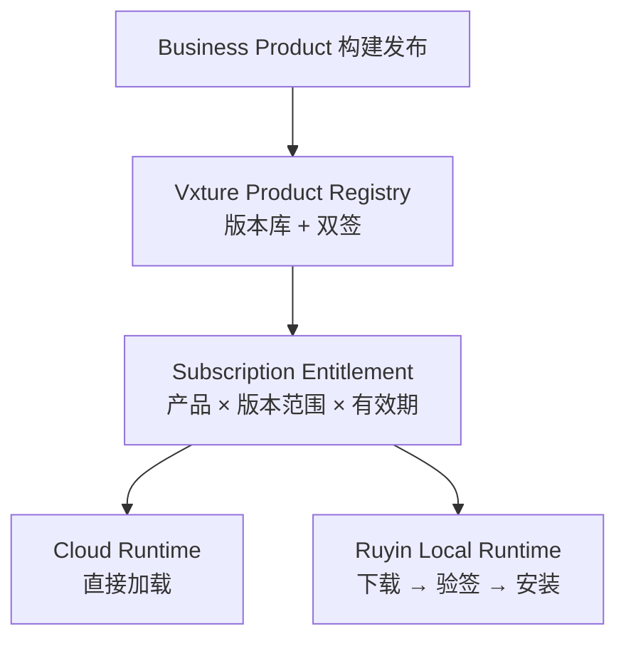

# 如影 Runtime Contract Schema：契约规范与产品分发设计

> **Ruyin Runtime Contract Schema & Distribution Specification**
>
> 文档编号：03-A（03《Runtime Contract 设计》的落地规范）  
> 文档版本：v0.1  
> 文档状态：架构设计基线  
> 所属平台：Vxture Platform  
> 关联文档：02 Workspace Runtime Architecture（v0.3）、03 Runtime Contract Design（v0.3）、04 Context Architecture（v0.1）

---

# 1. 文档定位

03 文档回答了契约**包含什么**（12 个组成部分）与**为什么**（7 条原则）。

本文件回答：

> **契约长什么样、如何被机器校验、如何打包并分发到两个运行时。**

三个产出：

1. 契约文件格式与逐字段规范（可直接转为 JSON Schema 实现校验）
2. 完整的 Bid 产品契约示例
3. 产品包与分发机制设计

范围对齐 03 §33 的 MVP 收敛：

```text
Identity / Workspace / Business Objects / Context /
AI Capabilities / Tasks / Permissions / Sync
```

Verification 作为 Task Definition 的子结构进入 MVP；
动态 UI Schema、工作流引擎、跨产品 Workspace 仍然排除。

---

# 2. 关键设计决策

| # | 决策 | 选择 | 理由 |
|---|---|---|---|
| D1 | 契约格式 | YAML（规范用 JSON Schema 定义） | 人可读、可评审；JSON Schema 生态成熟，两个运行时可用同一校验器 |
| D2 | 文件形态 | 单一 manifest：`ruyin.product.yaml` | 单一事实源；包内其它文件由 manifest 引用 |
| D3 | 产品 ID | 命名空间式 `vxture.bid` | 天然隔离，支持未来第三方 publisher |
| D4 | 版本模型 | 契约 schema 版本（`contract`）与产品版本（`product.version`）分离 | 契约规范演进不强迫产品发版，反之亦然 |
| D5 | 引用完整性 | 契约内所有交叉引用必须可解析 | 加载期失败优于运行期失败 |
| D6 | 数据分类入契约 | 每个 Context Type 必须标注 data class 与 sensitivity | 同步策略与推理传输策略需要静态依据（03 §19.1、02 §15.2） |

---

# 3. 契约顶层结构

```yaml
contract: "0.1"        # 契约 schema 版本（本规范的版本）

product: {}            # §5  产品身份
workspace: {}          # §6  工作空间定义
objects: []            # §7  业务对象
states: {}             # §8  业务状态机
context: {}            # §9  上下文需求
capabilities: []       # §10 AI 能力需求
tools: []              # §11 工具声明
tasks: []              # §12 任务定义
permissions: {}        # §13 权限默认值
sync: {}               # §14 同步策略
```

顶层键全部必填（MVP 无可选顶层键）。

---

# 4. 校验层级

```text
L1 结构校验     字段类型 / 必填性 / 枚举值 / 格式（JSON Schema 可表达）
L2 引用校验     契约内交叉引用完整性（见 §15 规则清单）
L3 兼容校验     contract 版本受支持、runtime.minimum 满足、能力可解析
L4 签名校验     包完整性与发布者身份（见 §18）
```

任何一层失败即拒绝加载；错误信息必须指明字段路径。

> **Same Contract, Any Runtime → Same Validator, Any Runtime：**
> Cloud Runtime 与 Local Runtime 使用同一校验器实现，这是 Runtime Conformance 的第一个可执行项。

---

# 5. product —— 产品身份

```yaml
product:
  id: vxture.bid          # 必填。命名空间式，全局唯一，[a-z0-9.-]
  name: 标书编写           # 必填。展示名
  version: 1.0.0          # 必填。SemVer
  publisher: vxture       # 必填。发布者 ID，必须与包签名身份一致（R12）
  runtime:
    minimum: 0.1.0        # 必填。所需最低 Workspace Runtime 规范版本
```

---

# 6. workspace —— 工作空间定义

```yaml
workspace:
  type: project           # 必填。persistent | project | document
  lifecycle: finite       # 必填。continuous | finite | versioned
  operations:             # 可选。默认 [create, open]
    - create
    - open
    - archive
    - restore
```

MVP 合法组合（声明冗余用于显式化，R2）：

| type | lifecycle |
|---|---|
| persistent | continuous |
| project | finite |
| document | versioned |

---

# 7. objects —— 业务对象

```yaml
objects:
  - id: bid_project       # 必填。snake_case，产品内唯一
    name: 投标项目         # 必填
    primary: true         # 可选。主对象（状态机挂载点），全契约恰好一个（R3）
    relations:            # 可选
      - to: requirement   # 必须引用已声明对象（R3）
        kind: contains    # contains | references | derives
```

---

# 8. states —— 业务状态机

```yaml
states:
  object: bid_project     # 必填。必须是 primary 对象（R4）
  initial: draft          # 必填。必须在 items 中（R4）
  items:
    - name: draft
      transitions:
        - to: planning
    - name: review
      transitions:
        - to: writing
        - to: submitted
          confirm: human  # 关键转换必须人工确认（02 §14）
    - name: submitted
      transitions: []
```

MVP 约束：每产品一个状态机，挂在主对象上。

---

# 9. context —— 上下文需求

```yaml
context:
  types:
    - id: tender_document       # 必填。snake_case，产品内唯一
      name: 招标文件
      required: true            # true → 缺失则依赖它的任务不可启动
      sources: [local, cloud]   # 允许来源种类（见下）
      class: source             # 数据分类。source|core|generated|derived|temporary
      sensitivity: high         # low | medium | high
```

`sources` 枚举：`cloud | local | lan | private | external | workspace`

要点：

- `sources` 只声明**允许的来源种类**；实际绑定（哪个文件夹、哪个知识库）是 Workspace 级运行时配置，不在契约中（04 文档 §3）
- `workspace` 来源指本工作空间既有生成物 —— 任务的 output 成为后续任务的可选 input
- `class` 对接同步策略（§14）；`sensitivity` 对接推理传输策略（04 文档 §7）

sensitivity 的默认运行时行为（用户策略可整体调整，见 04 文档 §7.2）：

| sensitivity | 推理传输行为 |
|---|---|
| low | 放行 + 审计 |
| medium | 放行 + 审计 |
| high | 用户确认 + 审计 |

---

# 10. capabilities —— AI 能力需求

```yaml
capabilities:
  - id: requirement_analysis    # 必填。产品内唯一
    kind: analysis              # analysis | generation | retrieval | verification
    description: 从招标文件中提取并结构化需求条目   # 必填。能力解析的语义依据
```

不出现任何模型名 / Provider 名（03 Principle 4，R6 禁止 `model:` 等绑定键）。

当前阶段所有能力经 Capability Resolver 一律解析到 Vxture 云端（02 §15.1）。

---

# 11. tools —— 工具声明

```yaml
tools:
  - id: read_file
    category: local_read    # local_read|local_write|query|generate|export|external_send
    risk: low               # low | medium | high
    default: allow          # allow | ask | deny
```

约束（R7）：

- `risk: high` 的工具 `default` 不得为 `allow`
- `category: external_send` 的工具 `default` 固定为 `ask`，产品不可放宽（02 §14：对外发送必须人工确认）

运行期执行语义：Harness Tool Gate = 契约默认值 ∩ 用户权限策略（02 §8.3）。

---

# 12. tasks —— Task Definition

对齐 02 §9.1 / 03 §16：

```yaml
tasks:
  - id: generate_proposal
    objective: 基于招标需求与企业能力生成技术方案
    input_types:                # ⊆ context.types[].id（R8）
      - tender_document
      - enterprise_capability
    output_types:               # ⊆ context.types[].id，class ∈ {generated, derived}（R8）
      - technical_proposal
    constraints:
      - 不得虚构企业能力
      - 必须基于已授权资料
    capabilities:               # ⊆ capabilities[].id（R8）；可为空（纯工具型任务）
      - proposal_generation
    tools:                      # ⊆ tools[].id（R8）
      - search_knowledge
      - read_file
      - write_document
    verification:
      - id: requirement_coverage
        kind: ai_assisted       # automated | ai_assisted | human
      - id: proposal_review
        kind: human
```

约束（R9）：

- 每个 task 的 verification 至少一条
- 产生 `generated` 类输出的 task 至少含一条 `kind: human` 验证 ——
  AI 生成的业务成果必须可被人确认（02 Principle 7 / 8）

> **契约只声明 Definition；Task Instance 是运行期对象，由 Harness 实例化，不出现在契约中。**

---

# 13. permissions —— 权限默认值

```yaml
permissions:
  local_read: allow
  local_write: ask
  delete: ask               # 固定不得为 allow（R10）
  external_send: ask        # 固定 ask（R10）
  sync_to_cloud: ask        # 固定不得为 allow —— 同步不是默认行为（01 §7.3，R10）
```

取值：`allow | ask | deny`

语义分层：

```text
产品契约声明的是默认值
        ↓
用户策略永远优先（可收紧可放松）
        ↓
Harness Tool Gate 执行合成结果（02 §8.3）
```

---

# 14. sync —— 同步策略

```yaml
sync:
  default: local_only         # 未匹配数据的兜底策略
  classes:
    - class: source
      policy: local_only      # local_only|cloud_only|bidirectional|manual|selective
    - class: core
      policy: selective
    - class: generated
      policy: manual
    - class: derived
      policy: local_only
    - class: temporary
      policy: local_only      # temporary 固定 local_only（R11）
```

与 §9 的 `class` 字段联动：每个 Context Type 经由其 data class 获得同步策略。

产品声明的是**能力与建议值**；用户策略永远拥有最终决定权（03 §19）。
同步策略只约束持久化存储，推理传输不属于同步范畴（02 §15.2）。

---

# 15. 校验规则清单

| 规则 | 内容 | 层级 |
|---|---|---|
| R1 | 顶层键完整；`contract` 版本受当前 Runtime 支持 | L1 / L3 |
| R2 | workspace type / lifecycle 组合合法 | L1 |
| R3 | relations.to 引用已声明对象；恰好一个 primary 对象 | L2 |
| R4 | states.object 为 primary 对象；initial 与所有 transitions.to 均在 items 中；无不可达状态 | L2 |
| R5 | 全部集合 id 唯一（objects / context.types / capabilities / tools / tasks / states.items）；required 类型的 sources 非空 | L2 |
| R6 | capabilities 不得出现模型 / Provider 绑定键 | L1 |
| R7 | risk=high 工具 default≠allow；external_send 类工具 default=ask | L1 |
| R8 | task 的 input_types / output_types / capabilities / tools 全部可解析；output_types 的 class ∈ {generated, derived} | L2 |
| R9 | 每个 task 至少一条 verification；含 generated 输出的 task 至少一条 human 验证 | L2 |
| R10 | permissions 中 delete / external_send / sync_to_cloud 不得为 allow | L1 |
| R11 | temporary 类同步策略固定 local_only | L1 |
| R12 | 包签名有效且签名身份与 product.publisher 一致 | L4 |

---

# 16. 完整示例：Bid 产品契约

以下契约通过 R1–R11 全部校验：

```yaml
contract: "0.1"

product:
  id: vxture.bid
  name: 标书编写
  version: 1.0.0
  publisher: vxture
  runtime:
    minimum: 0.1.0

workspace:
  type: project
  lifecycle: finite
  operations: [create, open, archive, restore]

objects:
  - id: bid_project
    name: 投标项目
    primary: true
    relations:
      - { to: requirement, kind: contains }
      - { to: proposal, kind: contains }
      - { to: deliverable, kind: contains }
  - id: requirement
    name: 需求条目
  - id: proposal
    name: 技术方案
    relations:
      - { to: requirement, kind: references }
  - id: deliverable
    name: 投标成果

states:
  object: bid_project
  initial: draft
  items:
    - name: draft
      transitions: [{ to: planning }]
    - name: planning
      transitions: [{ to: writing }]
    - name: writing
      transitions: [{ to: review }]
    - name: review
      transitions:
        - { to: writing }
        - { to: submitted, confirm: human }
    - name: submitted
      transitions: [{ to: archived, confirm: human }]
    - name: archived
      transitions: []

context:
  types:
    - id: tender_document
      name: 招标文件
      required: true
      sources: [local]
      class: source
      sensitivity: high
    - id: enterprise_capability
      name: 企业能力资料
      required: false
      sources: [local, cloud]
      class: source
      sensitivity: high
    - id: enterprise_knowledge
      name: 企业知识库
      required: false
      sources: [cloud]
      class: core
      sensitivity: medium
    - id: case_library
      name: 案例库
      required: false
      sources: [cloud, local]
      class: core
      sensitivity: medium
    - id: requirement_matrix
      name: 需求矩阵
      required: false
      sources: [workspace]
      class: derived
      sensitivity: medium
    - id: technical_proposal
      name: 技术方案文档
      required: false
      sources: [workspace]
      class: generated
      sensitivity: high
    - id: coverage_report
      name: 需求覆盖报告
      required: false
      sources: [workspace]
      class: derived
      sensitivity: medium
    - id: deliverable_package
      name: 投标成果包
      required: false
      sources: [workspace]
      class: generated
      sensitivity: high

capabilities:
  - id: requirement_analysis
    kind: analysis
    description: 从招标文件中提取并结构化需求条目
  - id: knowledge_retrieval
    kind: retrieval
    description: 从企业知识库与案例库检索相关内容
  - id: proposal_generation
    kind: generation
    description: 基于需求与企业能力生成技术方案内容
  - id: coverage_verification
    kind: verification
    description: 校验方案对需求条目的覆盖情况
  - id: consistency_analysis
    kind: verification
    description: 校验方案内部与资料间的一致性

tools:
  - { id: read_file,        category: local_read,  risk: low,    default: allow }
  - { id: write_document,   category: local_write, risk: medium, default: ask }
  - { id: search_knowledge, category: query,       risk: low,    default: allow }
  - { id: export_result,    category: export,      risk: high,   default: ask }

tasks:
  - id: analyze_tender
    objective: 解析招标文件，生成需求矩阵
    input_types: [tender_document]
    output_types: [requirement_matrix]
    constraints:
      - 需求条目必须可回溯到招标原文
    capabilities: [requirement_analysis]
    tools: [read_file, write_document]
    verification:
      - { id: source_traceability, kind: automated }
      - { id: matrix_review,       kind: human }

  - id: generate_proposal
    objective: 基于需求矩阵与企业能力生成技术方案
    input_types: [requirement_matrix, enterprise_capability, case_library, enterprise_knowledge]
    output_types: [technical_proposal]
    constraints:
      - 不得虚构企业能力
      - 必须基于已授权资料
    capabilities: [knowledge_retrieval, proposal_generation]
    tools: [search_knowledge, read_file, write_document]
    verification:
      - { id: requirement_coverage, kind: ai_assisted }
      - { id: consistency_check,    kind: ai_assisted }
      - { id: proposal_review,      kind: human }

  - id: validate_coverage
    objective: 校验技术方案对需求矩阵的覆盖情况
    input_types: [requirement_matrix, technical_proposal]
    output_types: [coverage_report]
    constraints:
      - 逐条对照，不得抽样
    capabilities: [coverage_verification, consistency_analysis]
    tools: [read_file, write_document]
    verification:
      - { id: coverage_complete, kind: automated }

  - id: export_deliverable
    objective: 汇总并导出最终投标成果包
    input_types: [technical_proposal, coverage_report]
    output_types: [deliverable_package]
    constraints:
      - 导出前必须通过覆盖校验
    capabilities: []
    tools: [read_file, export_result]
    verification:
      - { id: final_confirmation, kind: human }

permissions:
  local_read: allow
  local_write: ask
  delete: ask
  external_send: ask
  sync_to_cloud: ask

sync:
  default: local_only
  classes:
    - { class: source,    policy: local_only }
    - { class: core,      policy: selective }
    - { class: generated, policy: manual }
    - { class: derived,   policy: local_only }
    - { class: temporary, policy: local_only }
```

---

# 17. Same Contract, Any Runtime 的落实

同一份 `ruyin.product.yaml`，同一校验器，同一产品包：

```text
Vxture Cloud Runtime              Ruyin Local Runtime
        │                                 │
        └────────── 同一校验器 ────────────┘
        └────────── 同一契约包 ────────────┘
```

差异只体现在运行期解析结果：

| 契约字段 | Cloud Runtime 解析 | Local Runtime 解析 |
|---|---|---|
| context.sources: local / lan | 不可用（无绑定） | 连接器解析 |
| context.sources: cloud | 云端直接访问 | 经授权拉取 / 缓存 |
| capabilities | 云端 AI | 云端 AI（当前阶段） |
| sync | 无操作（数据已在云） | 执行用户策略 |

可启动性语义：required 类型在当前运行时无有效绑定 → 依赖它的任务在该运行时不可启动，
并明确报告缺失项。例如仅本地绑定的招标文件未同步时，`analyze_tender` 在 Cloud Runtime 不可用 —— 这是数据面差异的自然结果，不是缺陷。

---

# 18. 产品包与分发机制

## 18.1 包格式

```text
bid-1.0.0.ruyinpkg（zip 容器）
│
├── ruyin.product.yaml      # manifest，唯一事实源
├── ui/                     # 业务 UI 资源（web bundle，技术形态由 06 定）
├── resources/              # 模板 / 静态资源
├── i18n/                   # 多语言
├── CHECKSUMS               # 包内文件摘要清单
└── SIGNATURE               # 对 CHECKSUMS 的签名
```

## 18.2 签名与信任链

```text
Publisher 私钥 → 签名包摘要
        ↓
Vxture Product Registry 验证发布者身份 → 平台副署（双签）
        ↓
Runtime 安装 / 加载时验证：平台签名 + 发布者签名 + 摘要一致（L4 / R12）
```

- Runtime 只内置 Vxture Registry 根证书
- 第三方 publisher 由平台审核与背书；Runtime 不信任任何未经平台副署的包

## 18.3 分发通道



原则：

> **Same Contract, Any Runtime → Same Package, Any Runtime。**
> 云端与本地加载同一个产品包，不存在"本地特供版"。

## 18.4 更新与回滚

```text
Registry 新版本
    ↓
Entitlement 版本范围校验
    ↓
runtime.minimum 兼容性校验（L3）
    ↓
下载 → 验签 → 并行安装（不覆盖旧版本）
    ↓
切换；旧版本保留一份用于回滚
```

契约演进兼容规则（MVP 起即生效）：

| 产品版本变更 | 允许的契约变更 |
|---|---|
| patch | 不改契约语义（文案 / 资源） |
| minor | 只增不删：新增对象 / 类型 / 任务 / 能力；不得删除或改窄已有声明 |
| major | 可删改，但必须附数据迁移声明（格式后续版本定义） |

理由：Workspace 中的业务数据按对象与类型存储，删除声明会孤立既有数据。

## 18.5 离线与退订

| 场景 | 行为 |
|---|---|
| 离线（鉴权宽限期内） | 已安装产品可用；AI 能力不可用；同步入队 |
| 宽限期外 | 产品不可打开；本地数据可访问、可导出 |
| 退订 | 同上；重新订阅后恢复 |

数据主权底线（与 04 文档 §9.2 一致）：

> **任何授权状态下，用户的本地数据始终可访问、可导出。**

---

# 19. Open Questions

- UI 资源的技术形态与加载隔离（依赖 06 技术选型）
- 第三方 publisher 的审核与吊销流程
- 契约 diff / lint 工具链（发布前静态执行 R1–R11）
- major 版本数据迁移声明的格式
- 对象级合并策略声明（04 §8.3 提出，待纳入契约）

---

# 20. Final

> **产品声明业务，运行时校验与执行，用户策略永远最高优先。**
