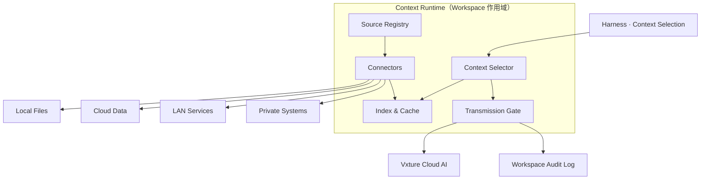

# 如影 Context Architecture：上下文架构设计

> **Ruyin Context Architecture**
>
> 文档编号：04  
> 文档版本：v0.1  
> 文档状态：架构设计基线  
> 所属平台：Vxture Platform  
> 关联文档：01（v0.3）、02（v0.3）、03（v0.3）、03-A（v0.1）

---

# 1. 文档定位

回答 01 §9.2 遗留的三个问题：

```text
2. SaaS 产品如何调用本地数据？
3. 云端 AI 如何处理本地工作？
4. 用户如何控制同步？
```

并落实 02 §15.2 立下的两项承诺：**上下文最小化选择**与**推理传输审计**。

范围：Context Runtime 的完整设计 —— 数据源、连接器、索引、选择、传输门控、同步与冲突、身份与访问。

---

# 2. 核心抽象

五个概念：

| 概念 | 定义 | 生命周期 |
|---|---|---|
| Context Type | 契约声明的数据类型（如 tender_document） | 随产品发布 |
| Context Source | 数据实际所在（某文件夹 / 某知识库） | Workspace 级配置 |
| Connector | 访问某类 Source 的组件 | Runtime 级安装 |
| Context Item | 最小上下文单元（一个文件 / 一条记录） | 随数据 |
| Context Set | 一次任务执行选定的 Item 集合 | 随 Task Instance |

主链路：

```text
契约声明 Context Type          要什么 —— 产品定义
        ↓
Source Registry 绑定 Source    在哪里 —— 用户配置
        ↓
Connector 提供访问             怎么拿 —— Runtime 能力
        ↓
Selector 构造最小 Context Set  拿多少 —— Harness 请求
        ↓
Transmission Gate 门控与审计   怎么出去 —— 用户策略
```

组件图：



---

# 3. Source 绑定模型

契约只声明类型与允许的来源种类（03-A §9）；实际绑定发生在 Workspace 级：

```yaml
# Workspace 配置（运行时数据，非契约）
bindings:
  tender_document:
    - source: local
      connector: local-fs
      root: "D:/bids/project-a/tender"
  enterprise_knowledge:
    - source: cloud
      connector: cloud-vxture
      ref: "kb://enterprise-main"
```

规则：

- 绑定的 source 种类必须在契约 `sources` 允许范围内
- required 类型无有效绑定 → 依赖它的任务不可启动（可启动性检查，03-A §17）
- 绑定配置属于 Workspace，随 Workspace 归档 / 同步（配置本身归 core 类数据）

---

# 4. Connector 模型

## 4.1 接口

```text
Connector
    ├── discover()      枚举可用 Item（仅元数据）
    ├── read(item)      读取内容
    ├── query(q)        条件检索（可选能力）
    └── watch()         变更通知（可选能力）
```

## 4.2 协议选择

> **连接器协议对齐 MCP（Model Context Protocol）。**

理由：LAN / 私有系统连接器可复用已有 MCP 生态；内置连接器以同一接口实现，不必然走进程外协议。

| 连接器 | 形态 |
|---|---|
| local-fs | 内置，文件系统能力由 Desktop Shell 提供（02 §17） |
| cloud-vxture | 内置，访问 Vxture 云端数据 / 知识库 |
| lan-* / private-* | MCP 兼容外部连接器，用户 / 企业安装 |

## 4.3 授权作用域

> **连接器授权以 Workspace 为边界（02 Principle 6）。**

本地文件授权模型：

```text
用户显式授权文件夹
    ↓
生成 Workspace 级 Grant（路径 + 只读 / 读写）
    ↓
local-fs 连接器只能在 Grant 范围内 discover / read
```

- Runtime 没有全盘访问权
- Grant 不跨 Workspace 共享
- Grant 变更进入审计

---

# 5. 索引与缓存

## 5.1 本地索引

Phase 1 策略：

```text
结构与关键词索引
    └── 本地构建，本地存储 —— 不产生任何数据外发

向量索引（语义检索）
    └── Embedding 计算需调用云端
        → 属于推理传输，受 §7 门控与 sensitivity 策略约束
        → high sensitivity 类型默认不做向量化，除非用户显式开启
```

索引产物（含向量）一律本地存储，随 Workspace 生命周期销毁。

## 5.2 云端上下文缓存

云端数据的本地缓存：加密存储、Workspace 作用域、可随时清除。
缓存是访问优化，不改变数据的同步策略归属。

---

# 6. Context Selection：最小化选择

## 6.1 选择管线

```text
Task Instance（input_types）
    ↓
候选集：类型绑定 Source 中的全部 Item
    ↓
过滤：Grant 范围 / 权限 / sensitivity 策略
    ↓
相关性排序：本地索引（关键词 / 结构；有向量则语义）
    ↓
预算裁剪：token budget 内取最小充分集
    ↓
Context Set
```

## 6.2 透明性原则

> **AI 看到的，用户看得到。**

- Context Set 在任务执行前对用户可见、可增删（Human Checkpoint 的组成部分）
- 含 high sensitivity Item 时，执行前必须经用户确认（02 §15.2 / 03-A §9）
- 最终 Context Set 全量进入审计事件（§7.3）

## 6.3 失败语义

required 类型选择结果为空 → 任务不启动，并明确报告缺失项 ——
而不是让 AI 在缺失上下文下猜测（"必须基于已授权资料"约束的执行面）。

---

# 7. Inference Transmission Gate

## 7.1 职责

推理传输是当前架构中唯一必然存在的本地 → 云端数据流动（02 §15.2）。
Gate 是它的**唯一出口**——任何组件不得绕过 Gate 向云端发送上下文：

```text
Context Set
    ↓
策略检查（sensitivity × 用户策略）
    ↓
[必要时] 用户确认
    ↓
传输至云端推理（TLS，会话级，即用即弃）
    ↓
审计事件写入
```

## 7.2 策略矩阵

默认值（03-A §9），用户策略可整体调整：

| sensitivity | 默认行为 |
|---|---|
| low | 放行 + 审计 |
| medium | 放行 + 审计 |
| high | 用户确认 + 审计 |

- 用户可设"全部确认"（最严）或"全部放行"（最松）
- 产品契约不能放松用户策略（03 Principle 5）

## 7.3 审计事件格式

```yaml
event: inference_transmission
task_instance: ti_20260723_0012
workspace: ws_bid_project_a
context_items:
  - id: item_tender_v2
    type: tender_document
    source: local
    content_hash: "sha256:..."
    bytes: 482113
destination: vxture-inference
persistence: none            # 云端不持久化承诺的记录面
confirmed_by: user           # user | policy
timestamp: "2026-07-23T10:12:00+08:00"
```

要点：

> **审计记录哈希与元数据，不记录内容本身 —— 审计日志不能成为二次泄露源。**

## 7.4 云端配合面

- 推理端点承诺 no-persistence（合同承诺 + 技术实现，实现细节归 06）
- `persistence: none` 使承诺进入每一条审计记录，可核查
- Embedding 计算（§5.1）走同一 Gate、同一事件格式（destination: vxture-embedding）

---

# 8. Sync Engine 与冲突处理

## 8.1 同步单元三级

```text
Workspace 级     整个工作空间（含业务状态与绑定配置）
Data Class 级    按 source / core / generated / derived 批量
Item 级          单个文件 / 单条业务对象
```

策略来源：契约声明建议值（03-A §14）→ 用户策略最终决定。

## 8.2 变更追踪与三向对比

每个同步 Item 维护三元组：

```text
(base_rev, local_rev, cloud_rev)
```

同步判定：

```text
local 变，cloud 未变      → push
cloud 变，local 未变      → pull
两端都变                  → conflict
```

## 8.3 冲突策略按数据形态分治

| 数据形态 | 策略 |
|---|---|
| 文件（文档 / 二进制） | 双版本并存，用户选择；不自动覆盖任何一方 |
| 结构化业务对象 | 字段级三向合并；同字段两端都变 → 冲突字段清单交用户 |
| 业务状态机 | 不自动合并；状态是业务事实，人工确认 |

补充：

- AI 辅助合并是一个 capability：生成合并建议，人确认后生效，永不自动执行
- 产品可声明对象级合并策略（契约未来扩展，已列入 03-A §19）

## 8.4 原则

> **冲突不是错误，是并行工作的自然结果。
> Runtime 的职责：不丢任何一方数据 + 给用户最小决策面。**

## 8.5 离线队列

- 同步操作幂等、可重试、断点续传
- 离线期间变更入队，恢复在线后按 §8.2 判定
- 队列本身属 Workspace 本地数据

---

# 9. Identity & Access

上下文访问与云端能力调用的前提。此处定义模型与语义；
token 协议、密钥保管、吊销机制等实现细节归 06。

## 9.1 身份链

```text
Vxture Account
    ↓ 登录（浏览器 OAuth / 设备码）
Device Registration（设备绑定，支持远程吊销）
    ↓
Runtime Session（短期 access token + refresh，OS 凭据库保管）
    ↓
Entitlement（订阅授权：产品 × 版本范围 × 有效期）
```

## 9.2 离线语义

| 状态 | 本地数据 | 本地产品 | 云端 AI | 同步 |
|---|---|---|---|---|
| 在线已登录 | ✅ | ✅ | ✅ | ✅ |
| 离线，宽限期内 | ✅ | ✅ | ❌ | 入队 |
| 宽限期外 / 退订 | ✅ 可访问可导出 | ❌ | ❌ | ❌ |

数据主权底线：

> **任何鉴权状态下，用户本地数据始终可访问、可导出。**

宽限期时长是产品策略参数（建议 7–30 天，企业版可配置），不是架构约束。

## 9.3 权限交汇模型

一次执行必须同时通过四层（对应 03 §20）：

```text
Identity      谁          账号 + 设备有效
Entitlement   哪个产品     订阅覆盖该产品与版本
Workspace     哪个空间     成员 / 所有者权限
Policy        做什么       Tool Gate ∩ Context 策略 ∩ Sync 策略
```

任何一层拒绝即拒绝；`ask` 语义逐层上浮，由 Harness Human Checkpoint 统一呈现。

---

# 10. 与其他文档的接口

| 本文件 | 对接 |
|---|---|
| §3 Source 绑定 | 03-A §9 context.types 声明 |
| §6 Selection | 02 §8.3 Harness Context Selection |
| §7 Gate 审计事件 | 02 §8.3 Audit Emission、02 §15.2 |
| §8 Sync | 01 §7.3 / 7.4、03-A §14 |
| §9 Identity | 03-A §18.5 离线与退订、06（实现） |

---

# 11. Open Questions

- 相关性排序的实现路径（纯本地启发式 vs 云端重排 —— 后者引入额外传输）
- 脱敏 / Redaction hooks（Phase 2：传输前对 high sensitivity 内容做本地脱敏）
- LAN 连接器的发现与信任模型（企业环境下由谁分发连接器）
- 同一账号多设备并发编辑同一 Workspace 的实时性要求（当前按 §8 异步冲突处理）

---

# Final

> **契约声明类型，用户绑定来源，Selector 最小化，Gate 管出口，冲突交用户，数据主权永远在用户。**
