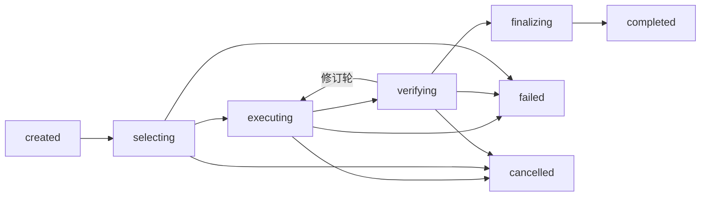

# 如影 Business Runtime Harness：任务执行内核设计

> **Ruyin Business Runtime Harness Design**
>
> 文档编号：05  
> 文档版本：v0.1  
> 文档状态：架构设计基线  
> 所属平台：Vxture Platform  
> 关联文档：02（v0.3）、03（v0.3）、03-A（v0.1）、04（v0.1）

---

# 1. 文档定位

02 §8 确立了 Harness 的定位（任务作用域受控沙箱）与能力清单；本文件把其中每一项从"一个词"变成机制：

| 02 中的词 | 本文件的机制 |
|---|---|
| Execution State Machine | §3 执行状态机 + §4 执行循环 |
| Tool Gate | §5 决策合成算法与 ask 缓存 |
| Human Checkpoint | §6 统一确认模型 |
| Verification | §7 验证编排与修订轮 |
| Recovery | §8 步骤日志与恢复决策表 |
| Audit Emission | §9 事件信封、种类与哈希链 |

Harness 是 Runtime Conformance 的主要验证对象（02 §8.2），因此本文件同时给出一致性清单（§10）。

---

# 2. Harness 在体系中的位置（回顾）

```text
Workspace Runtime（长生命周期）
    └── Harness Factory
            ↓ 用户启动任务时实例化
Business Runtime Harness（任务作用域）
    ├── 持有 Task Instance（02 §9.2）
    ├── 经 Context Runtime 选择上下文（04 §6）
    ├── 经 Transmission Gate 外发上下文（04 §7）
    ├── 经 Tool Gate 执行工具（本文件 §5）
    └── 任务结束销毁；中断可恢复（本文件 §8）
```

---

# 3. 执行状态机

## 3.1 状态集



| 状态 | 含义 | 终态 |
|---|---|---|
| created | 实例化完成：Task Definition + 输入 → Task Instance，步骤日志建立 | |
| selecting | Context Selection 进行中（04 §6 管线） | |
| executing | 能力调用循环（§4） | |
| verifying | 验证管线（§7） | |
| finalizing | 业务状态写回 + 审计收尾 | |
| completed | 成功结束，Harness 销毁 | ✅ |
| failed | 失败结束，步骤日志保留供诊断 | ✅ |
| cancelled | 用户取消 | ✅ |

## 3.2 横切挂起态

两个挂起态可从任何非终态进入，恢复后返回来源状态：

```text
waiting_human    由 Checkpoint 触发（§6）；决策后返回来源状态
suspended        由中断触发（进程退出 / 设备关机）；恢复后回断点（§8）
```

挂起态本身持久化 —— 等待人工确认的任务跨 Runtime 重启存活。

## 3.3 持久化点

每次状态转换即持久化（Task Instance 记录 + 步骤日志）。
这是恢复语义（§8）的基础：**任何时刻崩溃，损失不超过当前步骤。**

---

# 4. 执行循环

`executing` 状态的内部结构：

```text
loop:
    AI 步骤提议
    ├── 工具调用请求
    │       ↓
    │   Tool Gate 检查（§5）
    │       ↓ [ask → Checkpoint]
    │   执行工具 → 结果回传 AI
    │       ↓
    │   （继续循环）
    │
    └── 产出结果
            ↓
        退出循环 → verifying
```

约束：

- **每次工具调用独立过闸**，无会话级豁免 —— 第 1 次 allow 不意味着第 N 次 allow（ask 缓存除外，§5.3）
- 上下文补充请求（AI 要求更多资料）回到 Context Selector 走最小化管线与 Gate，不允许直接读取
- 循环步数有上限（Runtime 默认值，契约可声明更小值）；超限 → failed，防失控
- 每步进入步骤日志（§8.1）与审计（§9）

---

# 5. Tool Gate

## 5.1 决策合成

三层输入合成一个决策：

```text
硬底线（规范级，不可配置）
    ∧
用户策略（Workspace / 全局）
    ∧
契约默认值（03-A §11 / §13）
```

合成规则：

```text
1. 硬底线命中 → 按硬底线（最高优先）
2. 用户策略有显式设置 → 按用户策略（可收紧可放松）
3. 否则 → 按契约默认值
```

硬底线清单（02 §14 的规范化）：

| 操作类别 | 底线 | 理由 |
|---|---|---|
| external_send（对外发送） | ≥ ask，任何一方不可放松为 allow | 出了边界收不回 |
| delete（删除文件 / 业务对象） | ≥ ask | 不可逆 |
| 关键状态转换（contract 声明 confirm: human） | ask | 业务事实由人确认 |
| sync_to_cloud | 契约不得默认 allow；**用户可显式设为 allow** | 同步是用户的数据权利（01 §7.3），用户选择自动同步是行使控制而非放弃控制 |

## 5.2 参数校验

工具调用在放行前校验参数：

```text
参数符合工具 Input Schema（03 §14）
路径类参数落在 Workspace Grant 范围内（04 §4.3）
引用的 Context Item 在本任务 Context Set 内
```

任一不满足 → 拒绝该次调用并回传 AI（AI 可修正重试，计入循环步数）。

## 5.3 ask 决策缓存

用户面对 ask 时可声明决策作用域：

| 作用域 | 含义 | 持久化 |
|---|---|---|
| once | 仅本次调用 | 否 |
| task | 本 Task Instance 内同工具同参数模式 | 随任务 |
| workspace | 本 Workspace 内长期生效（成为用户策略） | 是 |

- 硬底线操作不提供 workspace 级缓存（每次确认）
- 所有决策进入审计（§9）

---

# 6. Human Checkpoint

## 6.1 统一模型

所有需要人参与的节点收敛为一个模型，由 Workspace UI 统一呈现（04 §9.3）：

```yaml
checkpoint:
  id: cp_...
  kind: context_confirm      # 见 6.2
  task_instance: ti_...
  subject:                   # 被决策对象，完整可见
    ...                      # 按 kind 定义
  options: [approve, reject, modify]
  decision:                  # 决策后填充
    by: user_id
    choice: approve
    at: timestamp
```

## 6.2 Checkpoint 种类

| kind | 触发点 | subject |
|---|---|---|
| context_confirm | Context Set 含 high sensitivity（04 §6.2） | 完整 Context Set 清单 |
| transmission_confirm | 推理传输策略要求确认（04 §7.2） | 待传输 Item 清单 |
| tool_ask | Tool Gate 决策为 ask（§5） | 工具 + 参数 + 影响说明 |
| state_transition | 契约 `confirm: human` 的状态转换（03-A §8） | 转换前后状态 + 依据 |
| verification_review | `kind: human` 的验证规则（§7） | 结果 + 自动验证报告 |
| result_acceptance | 任务最终成果接受 | Business Result（03 §18 全字段） |

## 6.3 语义

- **阻塞**：Checkpoint 挂起当前步骤，任务进入 waiting_human
- **无超时自动通过**：等待没有时限，永不默认放行；提醒经 Desktop Shell 通知（02 §17）
- **排队**：多个 Checkpoint 按产生顺序呈现；不同任务的 Checkpoint 互不阻塞
- **modify 语义**：用户可修改 subject（如增删 Context Item、改工具参数）后批准，修改进入审计
- 决策与 subject 摘要全部进入审计（§9）

## 6.4 送达（2026-08-31，MVP M4）

> **无超时自动通过**的另一面：等待既然永不自动放行，那么**没被送达的等待就是
> 永久卡死**。停在等人那一刻若无人知晓，等于没停。

未决确认原先只在它所属的**那一个**任务界面里可见——等于要求用户已经在看那个
唯一会告诉他的地方。两条送达通路，看同一份事实（`GET /pending`，跨项目汇总，
**最久的排最前**——等得越久越容易被忘掉）：

| 通路 | 由谁 | 说明 |
|---|---|---|
| 系统通知 | Desktop Shell | 壳**轮询守护进程的 HTTP 面**，不走 IPC |
| 常驻入口 | Workspace UI | header 上的计数 + 清单，点击直达决定点 |

**壳为什么轮询 HTTP 而不是收页面的推送**：窗口是纯 Web 客户端，无 preload、
无 Node（60 §4.2）——契约边界就该留在 HTTP。附带好处是渲染进程忙碌、被最小化
或在别的视图时，通知照发。

**只播报新出现的确认**，且**首轮只建基线不播报**：启动时本来就在等的是用户马上
会在界面上看到的积压，不是新消息；把它当新消息播报，等于每次启动都来一串弹窗，
**训练用户忽略掉真正要紧的那一条**。

---

# 7. Verification 编排

## 7.1 管线顺序

验证规则按代价升序执行，快速失败：

```text
automated        确定性规则（结构 / 覆盖 / 一致性检查）
    ↓ 通过
ai_assisted      AI 评审
    ↓ 通过
human            verification_review Checkpoint
```

前两者**都走同一 Capability Resolver 与 Transmission Gate，解析到产品的能力面**。

> **更正（2026-08-31，ADR-010）。** 本节原写 automated 为「本地执行」，据此
> 曾把它理解为 Runtime 要内建一批检查——**该理解作废**。契约只说「检查什么」
> 的名字，**产品才知道那个名字是什么意思**；Runtime 只负责编排（排序、调用、
> 收结果、失败进修订轮、终点交人、留痕），不介入检查内容。
>
> 因此 `kind` 的作用从「在哪执行」降为**「代价／排序提示」**——正好就是本节
> 「按代价升序、快速失败」的依据：automated 确定性、便宜，该先跑。

## 7.2 修订轮

automated / ai_assisted 未通过时：

```text
验证反馈（缺失项 / 矛盾清单）
    ↓
回到 executing，反馈注入下一轮生成
    ↓
最多 N 轮（Runtime 默认 2，契约可声明）
    ↓ 仍未通过
verification_review Checkpoint：
    交人决定 —— 接受现状 / 手工修改后接受 / 判定失败
```

> **验证不通过的终点永远是人，不是静默丢弃，也不是无限重试。**

## 7.3 结果构造

通过验证后，Harness 构造 Business Result（03 §18）：

```text
Business Result
    ├── Content            成果本体
    ├── Source             使用的 Context Item 清单（哈希引用）
    ├── Verification       各规则结论 + 轮次
    └── Provenance         生成任务 / 能力 / 时间
```

Provenance 使成果可回溯到"基于哪些已授权资料"—— 契约约束（如"不得虚构企业能力"）的可核查面。

---

# 8. 恢复语义

## 8.1 持久化内容

```text
Task Instance 记录     当前状态 + Context Set 引用 + 累计轮次
步骤日志（Journal）    每个完成步骤：类型 / 输入哈希 / 输出 / 完成标记
Checkpoint 记录        未决 Checkpoint 原样持久化
```

## 8.2 步骤分类

| 类型 | 例 | 恢复策略 |
|---|---|---|
| 可重复步骤 | 读取、检索、AI 调用 | 直接重做（AI 调用非确定，未提交结果作废重来） |
| 副作用步骤 | 写文档、导出、状态写回 | journal-before-write：先记意图 → 执行 → 记完成标记 |

## 8.3 恢复决策表

Runtime 重启后扫描非终态 Task Instance：

| 中断点 | 恢复行为 |
|---|---|
| selecting | 重新执行选择（选择管线幂等） |
| executing，AI 调用中 | 丢弃未完成调用，从上一日志步重试 |
| executing，副作用步骤中 | 查完成标记：有 → 跳过；无 → 核对目标状态后重做 |
| verifying | 重跑未完成的验证规则（验证幂等） |
| waiting_human | 原样恢复挂起，Checkpoint 重新呈现 |
| finalizing | 依据日志重放写回（写回幂等） |

恢复本身产生 `task.resumed` 审计事件。

## 8.4 瞬态错误重试

网络 / 云端 AI 暂不可用属瞬态错误：

```text
指数退避重试（Runtime 默认 3 次）
    ↓ 仍失败
任务转 suspended，提示用户
    ↓ 网络恢复 / 用户触发
按 §8.3 恢复
```

瞬态错误不消耗修订轮次数，不导致 failed。

---

# 9. 审计事件

## 9.1 事件信封

Workspace 级审计日志（02 §7.1）中每条事件的统一信封：

```yaml
event_id: ev_01J...          # 单调有序（ULID）
workspace: ws_...
task_instance: ti_...        # 可空（Workspace 级事件）
kind: tool.executed
actor: harness               # harness | user | system
timestamp: "2026-07-23T10:12:00+08:00"
prev_hash: "sha256:..."      # 前一事件哈希 → 链式完整性
payload: {}                  # 按 kind 定义
```

04 §7.3 定义的推理传输事件即 `kind: transmission.inference` 的 payload；信封由本节统一补齐。

## 9.2 事件种类

| 分组 | kind | payload 要点 |
|---|---|---|
| 任务生命周期 | task.created / task.state_changed / task.completed / task.failed / task.cancelled / task.resumed | 状态转换、失败原因 |
| 上下文 | context.selected / context.confirmed | Item 清单（哈希引用） |
| 传输 | transmission.inference / transmission.embedding | 04 §7.3 schema |
| 工具 | tool.requested / tool.decision / tool.executed | 工具 + 参数摘要 + 决策来源（硬底线/用户策略/契约默认/ask 缓存） |
| 能力 | capability.invoked / capability.completed | 能力 ID + 轮次 |
| 验证 | verification.run / verification.result | 规则 + 结论 + 轮次 |
| 确认 | checkpoint.raised / checkpoint.decided | kind + subject 摘要 + 决策 |
| 状态 | state.writeback | 业务状态变更 |
| 授权 | grant.changed / binding.changed | 文件夹 Grant 与上下文绑定变更（04 §3 / §4.3） |
| 同步 | sync.push / sync.pull / sync.conflict / sync.resolved | 同步单元 + 判定（04 §8） |

## 9.3 完整性与存储

- **append-only + 哈希链**：每条事件含前条哈希，创世事件锚定 Workspace ID —— 截断与篡改可检测
- 内容一律以哈希引用，不落原文（04 §7.3 原则：审计不成为二次泄露源）
- 审计日志归 core 数据类，默认 local_only，用户可选同步（企业合规场景）
- 随 Workspace 归档保留

---

# 10. Runtime Conformance 清单

Harness 行为是两个运行时一致性的主要验证面（02 §8.2）。可测项：

| # | 一致性要求 |
|---|---|
| C1 | 同一契约 + 同一输入 → 状态序列一致 |
| C2 | 同一契约默认 + 同一用户策略 → Tool Gate 决策一致 |
| C3 | Checkpoint 触发点与 kind 一致 |
| C4 | 审计事件种类与顺序一致（AI 非确定输出的内容哈希除外） |
| C5 | 恢复后副作用不重复（journal-before-write 语义一致） |
| C6 | 验证规则执行顺序与修订轮语义一致 |
| C7 | 硬底线在任何配置下不可绕过 |

一致性测试套件以此清单为骨架（实现归 06）。

---

# 11. 与其他文档的接口

| 本文件 | 对接 |
|---|---|
| §3 状态机 / §8 恢复 | 02 §8.4 生命周期骨架 |
| §4 执行循环 | 02 §8.3 能力链、04 §6 选择管线 |
| §5 Tool Gate | 03-A §11 / §13 声明、04 §9.3 权限交汇 |
| §6 Checkpoint | 02 §14、03-A §8 confirm: human |
| §7 验证 | 03 §17、03-A §12 verification |
| §9 审计 | 02 §7.1 Audit Log、04 §7.3 传输事件 |
| §10 Conformance | 02 §8.2、03 Principle 7 |

---

# 12. Open Questions

- 单 Workspace 并发任务：MVP 是否限定同时一个活动 Task Instance（持续型业务如 CRM 的后台分析任务需要并发时如何隔离）
- 取消语义：cancelled 时已完成副作用步骤是否提供撤销（当前：保留并在审计中可见，不自动回滚）
- AI 调用计量与配额（成本核算挂 Harness 还是 Capability Resolver）
- 企业协作场景 Checkpoint 的代理与升级（谁有权代表 Workspace 确认）
- 步骤日志的保留策略（任务完成后保留多久 / 是否并入审计归档）

---

# Final

> **Harness 一句话：AI 在契约边界内循环，每一步过闸、每一步留痕、每一步可恢复，关键节点永远等人。**
