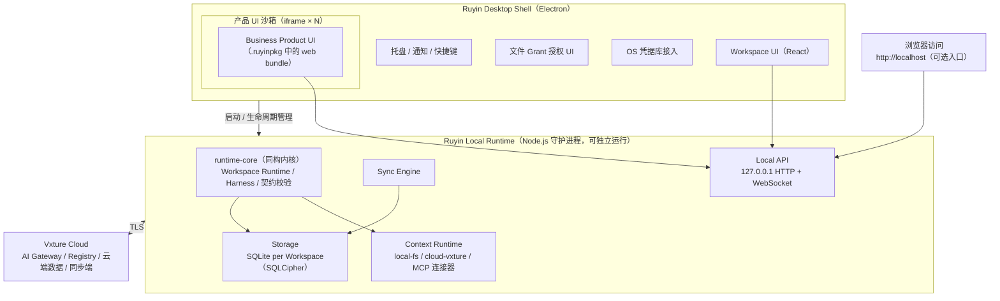

# 如影 Technical Architecture：技术架构设计

> **Ruyin Technical Architecture**
>
> 文档编号：06  
> 文档版本：v0.1  
> 文档状态：架构设计基线（选型含复评触发条件）  
> 所属平台：Vxture Platform  
> 关联文档：01（v0.3）、02（v0.3）、03（v0.3）、03-A（v0.1）、04（v0.1）、05（v0.1）  
> 选型依据时点：2026 年 7 月（含主流技术现状与趋势核实）

---

# 1. 文档定位

01–05 定义了 Ruyin 的产品与运行时语义；本文件回答：

> **用什么技术，把这套语义变成可交付的软件。**

每个选型给出：选择、备选、理由、**复评触发条件** —— 技术决策不是永久承诺，
但复评必须由明确信号触发，而不是随时摇摆。

---

# 2. 实现目标

技术架构必须兑现的目标，全部可回溯到上游文档：

| # | 目标 | 来源 |
|---|---|---|
| G1 | **同核两宿主**：Cloud / Local Runtime 共享同一执行内核，Conformance 尽量由构造保证而非仅靠测试 | 02 §15、05 §10 |
| G2 | **离线可用**：宽限期内本地产品与数据可用，AI 能力优雅降级 | 04 §9.2 |
| G3 | **数据主权技术兜底**：本地数据可导出、审计哈希链可校验、退订不失数据 | 04 §9.2、05 §9.3 |
| G4 | **安全边界可执行**：文件 Grant、包验签、进程隔离、密钥托管、本地 API 防滥用 | 03-A §18、04 §4.3、05 §5 |
| G5 | **资源占用可接受**：常驻内存目标 < 500MB，冷启动 < 5s（企业办公机标准） | 产品可用性 |
| G6 | **部署环境覆盖**：Windows 10/11 优先；保留国产化（信创）Linux 路线 | 目标行业（能源/水务/应急/政务，01 §3） |
| G7 | **交付速度**：复用团队 TypeScript 技能栈与云端代码 | 工程现实 |
| G8 | **产品 UI 隔离**：业务产品 UI 故障或恶意不越出契约边界 | 03-A §18、未来第三方 publisher |

---

# 3. 技术趋势扫描（2026 年中）

## 3.1 桌面应用框架

| 框架 | 现状 | 趋势 |
|---|---|---|
| Electron | 最成熟；自带 Chromium + Node，渲染全平台一致；安装包 ~150MB、常驻内存高 | 增长平台期，但企业级桌面产品主力仍在 |
| Tauri 2.x | Rust 核 + 系统 WebView；安装包 ~10MB 级、内存约省一半 | 2024 年 2.0 后爆发，仓库年增 35–55%，**新项目的主流默认项** |
| Flutter / Qt / .NET MAUI | 各有领域 | 与 Web 技术栈产品复用目标不符，不展开 |

行业共识：新桌面应用默认考虑 Tauri；选 Electron 的核心理由是渲染一致性、
Node 主进程、最成熟的打包/更新生态、重度企业环境兼容先例。

## 3.2 JavaScript 运行时

| 运行时 | 现状 |
|---|---|
| Node.js（LTS） | 稳定性与生态最广；重依赖、安全敏感场景首选 |
| Bun | 1.x 已生产可用（2025-10 被 Anthropic 收购，Claude Code / Midjourney / X 生产使用）；HTTP 吞吐约 1.7–2×，冷启 4–5× | 
| Deno | 安全模型好，生态位较窄 |

2026 年通行模式：**存量服务留 Node，新服务上 Bun**；原生模块（如 SQLCipher 绑定）仍以 Node 最稳。

## 3.3 本地数据

- **SQLite 复兴**：单文件、零运维，扩展到向量检索（sqlite-vec：纯 C、零依赖、SIMD 加速、含 WASM），FTS5 提供全文检索 —— 本地索引（04 §5.1）的关键词与向量两层可以落在同一个库文件里
- **Local-first 运动**：CRDT（Yjs / Automerge）与同步引擎（ElectricSQL / PowerSync）活跃。**Ruyin 明确不采用 CRDT 自动合并**：04 §8.3 的设计是冲突显式交给用户（业务事实不可静默合并），CRDT 的自动收敛语义与此相悖。借鉴 local-first 的原则（本地为主、同步可选），不借用其合并机制
- 加密静态存储：SQLCipher 成熟；密钥托管于 OS 凭据设施

## 3.4 连接器协议

MCP（Model Context Protocol）已从 Anthropic 规范成为**行业事实标准**：
Linux Foundation 治理，OpenAI / Google / Microsoft 全部支持，2026 年初公开
MCP 服务器超 1 万个，财富 500 企业实施率约 28%。

→ 04 §4.2"连接器协议对齐 MCP"的决策被行业演进验证，维持并强化：
外部连接器直接采用 MCP 标准传输（stdio / Streamable HTTP），复用生态。

## 3.5 AI 调用

- 云端推理主流形态：网关统一入口、SSE 流式、结构化输出（JSON Schema 约束）、工具调用循环
- 本地小模型（NPU 加速）在终端侧兴起 —— 对 Ruyin 是 Phase 3 的 Capability Resolver 解析目标扩展，当前不进入架构，但 Resolver 抽象已为此预留（02 §15.1）

## 3.6 前端与产品 UI 装载

- React + TypeScript 仍是企业应用主流；构建工具 Vite 系
- 插件化 UI 两条路线：Module Federation（性能好、隔离弱）vs **沙箱 iframe**（强隔离边界、postMessage 通信）。对承载未来第三方产品的平台，沙箱 iframe 是安全默认

---

# 4. 总体架构

## 4.1 进程拓扑



## 4.2 关键结构判断

1. **Runtime 是独立守护进程，Shell 只是宿主之一** —— 直接落实 02 §17
   "Desktop 是壳，Runtime 是核心，Web 是访问方式"；同一进程未来可部署到
   局域网服务器成为团队私有 Runtime（Phase 3 路径，不为其提前设计，但不堵死）
2. **产品 UI 永远经 Local API 访问 Runtime**，Shell 不给产品 UI 任何特权通道 ——
   契约边界在进程边界上可执行（G8）
3. **同一套产品包（.ruyinpkg）**：云端 Runtime 加载其 UI bundle 于浏览器，
   本地加载于沙箱 iframe —— Same Package, Any Runtime（03-A §18.3）落地

---

# 5. 技术决策清单

| # | 决策域 | 选择 | 备选 | 复评触发条件 |
|---|---|---|---|---|
| T1 | 进程拓扑 | Shell + 独立 Runtime 守护进程 + Web 访问 | 单进程一体化 | —（结构性决策） |
| T2 | Runtime 语言/宿主 | TypeScript / Node.js LTS | Bun（生产已可用） | core 不依赖宿主特性；当性能瓶颈实测在宿主层时试点 Bun |
| T3 | 共享内核 | runtime-core 同构 TS 包（§6） | 双端独立实现 + 测试对齐 | —（G1 的直接手段） |
| T4 | Desktop 壳 | **Electron** | Tauri 2.x | 见 §5.1 专项论证 |
| T5 | UI 技术 | React 18+ / TypeScript / Vite | Vue / Svelte | 团队技能变化 |
| T6 | 产品 UI 装载 | 沙箱 iframe + postMessage 桥 | Module Federation | 第一方产品性能实测不可接受时对可信包放宽 |
| T7 | 本地存储 | SQLite（better-sqlite3）+ SQLCipher，每 Workspace 一库；FTS5 关键词索引；sqlite-vec 向量索引 | LevelDB / 自研文件格式 | —（生态与单文件模型契合度高） |
| T8 | 连接器 | MCP 标准（外部：stdio / Streamable HTTP；内置连接器进程内同接口） | 自研协议 | —（行业标准已确立） |
| T9 | 身份 | OAuth 2.0 Authorization Code + PKCE（系统浏览器 + loopback 回调）；token 存 OS 凭据库 | 设备码流 | 企业 SSO 接入需求时扩展 |
| T10 | 能力通道 | **产品自己的云端能力面**为统一入口（回合制：发历史+上下文+可用工具，收 tool_calls / content / verdict）；Runtime 不直连任何模型 Provider，**也不直连 Atlas**——凭证与模型选择都在产品那一侧（ADR-009 / 011，2026-08-31 修订：原写 "Vxture AI Gateway 统一入口"） | — | —（03 Principle 4 的基础设施面） |
| T11 | 本地 API | 127.0.0.1 绑定 HTTP + WebSocket；每会话随机 token | 命名管道 / gRPC | 浏览器入口与 iframe 桥都需要 HTTP，维持 |
| T12 | 仓库结构 | pnpm workspaces monorepo | 多仓库 | —（共享内核决定） |
| T13 | 打包与更新 | electron-builder + 自动更新；企业环境提供离线 MSI；产品包走 03-A §18 独立通道 | — | 信创路线启动时补充 Linux 打包 |

## 5.1 T4 专项论证：为什么是 Electron 而不是趋势上更热的 Tauri

趋势明确偏向 Tauri（§3.1），但 Ruyin 的四个具体约束改变了权衡：

| 约束 | 对选型的影响 |
|---|---|
| Runtime 守护进程反正要带 Node | Tauri 最大优势（不带 JS 运行时、包小）被显著削弱 —— 我们总要分发 Node 层 |
| 团队纯 TypeScript（云端同栈） | Tauri 要求 Rust 能力维护壳层；Electron 全栈一种语言（G7） |
| 目标行业含政务/能源，存在国产化（信创）Linux 交付前景 | Electron 在麒麟/统信上有大量成熟先例（国内主流桌面协作软件均为此路线）；Tauri 依赖系统 webkitgtk，在信创环境版本老旧、渲染质量风险高（G6） |
| 标书/文档类产品对渲染一致性敏感 | Electron 自带 Chromium 全环境一致；Tauri 随系统 WebView 漂移 |

**复评触发条件**（满足任一即重新评估 Tauri）：

1. 安装包体积 / 常驻内存成为客户采购的实际障碍（G5 失守）
2. 团队建立稳定的 Rust 能力
3. 信创环境的系统 WebView 状况实质改善
4. Runtime 宿主迁移到无需分发 Node 的形态

---

# 6. 共享内核设计（G1 的实现）

## 6.1 结构

```text
packages/
├── contract-schema        契约类型 + JSON Schema + 校验器（ajv）
│                          ——— 两个 Runtime 用同一校验器（03-A §4）
├── runtime-core           同构执行内核（不含任何宿主 API）
│   ├── workspace          Workspace 生命周期 / Business State
│   ├── harness            状态机 / 执行循环 / Tool Gate / Checkpoint / 验证编排（05）
│   ├── context            Selection 管线 / Transmission Gate 策略（04 §6/§7）
│   ├── audit              事件信封 / 哈希链（05 §9）
│   └── ports              宿主接口（见 6.2）
├── local-host             Node 宿主：实现 ports + Local API + Sync Engine
├── shell                  Electron 壳
├── ui-workspace           Workspace UI（React）
└── products/*             业务产品包源码（bid / crm / document）
```

云端侧：Cloud Runtime 以同一 `runtime-core` + 云宿主（实现同一组 ports）构成。

## 6.2 Ports（宿主必须实现的接口）

```text
StoragePort        对象 / 状态 / 日志 / 审计的持久化
ConnectorPort      上下文来源访问（本地宿主接 MCP 与 local-fs；云宿主接云数据）
AIGatewayPort      能力调用（双端都指向 Vxture AI Gateway）
CryptoPort         哈希 / 签名验证 / 加密
KeychainPort       凭据保管（本地：OS 凭据库；云端：KMS）
ClockPort / IdPort 时间与标识（可注入 → 内核可测试、可重放）
```

## 6.3 Conformance by Construction

```text
契约校验一致        同一 contract-schema 包            → 构造保证
状态机 / Gate /
Checkpoint 语义     同一 runtime-core                 → 构造保证
宿主行为（存储 /
连接器 / 恢复）      C1–C7 一致性测试套件（05 §10）      → 测试保证
```

一致性测试以 runtime-core 的可注入 ports 为桩位，同一测试集跑双宿主。

---

# 7. 存储设计

## 7.1 每 Workspace 一库

```text
%APPDATA%/Ruyin/
├── runtime/                     runtime 级配置 / 会话 / 产品包缓存
└── workspaces/
    └── ws_<id>/
        ├── workspace.db         SQLite（SQLCipher 加密）
        ├── files/               文件区（内容寻址，哈希命名）
        └── exports/             用户导出区
```

理由：Workspace 是数据 / 权限 / 同步 / 归档边界（02 Principle 6）——
一库一空间使归档 = 打包目录、销毁 = 删除目录、导出（G3）= 复制 + 解密。

## 7.2 表结构与上游机制映射

| 表 | 承载 | 上游 |
|---|---|---|
| objects | 业务对象（JSON + 生成列索引） | 03-A §7 |
| state | 业务状态机当前态与历史 | 03-A §8 |
| task_instances | Task Instance 记录 | 05 §8.1 |
| journal | 步骤日志（journal-before-write） | 05 §8.2 |
| audit_events | 审计事件 + prev_hash 哈希链 | 05 §9 |
| checkpoints | 未决 / 已决 Checkpoint | 05 §6 |
| bindings / grants | Source 绑定与文件 Grant | 04 §3 / §4.3 |
| sync_meta | 每同步单元 (base_rev, local_rev, cloud_rev) | 04 §8.2 |
| sync_queue | 离线同步队列 | 04 §8.5 |
| fts_index（FTS5） | 关键词 / 结构索引 | 04 §5.1 |
| vec_index（sqlite-vec） | 向量索引（用户开启后） | 04 §5.1 |

## 7.3 加密与密钥

```text
workspace.db → SQLCipher 静态加密
密钥 → 每 Workspace 独立 → 主密钥封装 → OS 凭据库（Windows Credential Manager / DPAPI）
files/ 区 → 同密钥体系加密
```

---

# 8. 本地服务与 API

## 8.1 传输与认可

- 仅绑定 `127.0.0.1`；每次 Runtime 启动生成随机会话 token，Shell / 浏览器入口 / 产品 iframe 均须携带 —— 防同机其他进程滥用（G4）
- HTTP：REST 风格资源（workspaces / tasks / checkpoints / bindings / sync）
- WebSocket：事件流 —— 任务状态转换、执行进度、Checkpoint 提出、同步状态（05 §3 状态机的实时投影）

## 8.2 产品 UI 桥

```text
产品 iframe（sandbox 属性 + 独立 origin + CSP）
        │  postMessage
Workspace UI 桥接层（能力白名单：仅本产品契约声明范围）
        │  携带会话 token
Local API
```

产品 UI 能做什么由其契约决定，桥接层按契约裁剪 API 面 ——
UI 层不可能越出 Tool Gate / 权限模型（G8）。

---

# 9. 安全架构汇总

| 层 | 机制 | 上游 |
|---|---|---|
| 包 | 双签验证（publisher + 平台副署） | 03-A §18.2 |
| 进程 | Runtime 与 Shell 分离；产品 UI 沙箱 iframe | §4 |
| 文件 | Grant 白名单，无全盘访问 | 04 §4.3 |
| 数据 | SQLCipher 静态加密 + OS 凭据库托管密钥 | §7.3 |
| 网络 | 仅 loopback 本地 API + 会话 token；对云 TLS | §8.1 |
| 外发 | Transmission Gate 唯一出口 + 审计哈希链 | 04 §7、05 §9 |
| 操作 | Tool Gate 硬底线（规范级不可绕过） | 05 §5.1 |
| 身份 | PKCE + 短期 token + 设备绑定可吊销 | 04 §9.1 |

---

# 10. 交付形态与更新

```text
Ruyin 安装包（Shell + Runtime + 内置连接器）
    ├── 在线：自动更新通道
    └── 企业：离线 MSI + 内网分发

产品包（.ruyinpkg）
    └── 独立于 Ruyin 更新，走 Registry + Entitlement（03-A §18）

runtime-core 版本 = Workspace Runtime 规范版本的实现版本
    └── 契约 runtime.minimum 对其校验（03-A §5）
```

---

# 11. 国产化（信创）路线说明

目标行业（政务 / 能源 / 水务 / 应急）存在国产化交付要求的现实可能。本架构的预留：

- Electron 官方支持 Linux（含 arm64），麒麟 / 统信有行业先例（§5.1）
- Node.js / SQLite / SQLCipher 均有 Linux arm64 / LoongArch 社区或商业支持
- 不在 MVP 投入，但 **T4/T7 选型时已把该路线作为约束计入** —— 这是趋势之外，Ruyin 自己的市场因素

启动条件：出现真实国产化交付合同时，以专项启动适配与测试矩阵。

---

# 12. 分阶段实施建议

```text
Phase A · 骨架贯通（验证架构，不求功能全）
    contract-schema 包 + 校验器（R1–R11 可执行）
    runtime-core：Workspace 生命周期 + Harness 状态机（无 AI，模拟能力）
    local-host：SQLite 存储 + Local API
    Shell：启动 Runtime + 加载一个最小产品包（验签 → 校验 → iframe 装载）
    ★ 里程碑：Bid 契约示例（03-A §16）被完整加载并创建 Workspace

Phase B · 单产品可用（Bid MVP）
    Context Runtime：local-fs 连接器 + Grant + FTS5 索引 + Selection 管线
    AI Gateway 对接：真实能力调用 + 流式 + Transmission Gate + 审计链
    Checkpoint UI + 验证编排 + 恢复语义
    ★ 里程碑：本地招标文件 → 需求矩阵 → 方案生成 → 人工确认 → 导出，全程审计可查

Phase C · 双端与同步
    Cloud Runtime 宿主接入 runtime-core；C1–C7 一致性套件
    Sync Engine：三向对比 + 冲突 UI + 离线队列
    身份完整链（PKCE / 设备绑定 / 宽限期）
    ★ 里程碑：同一 Workspace 云端 ↔ 本地往返，冲突可解，Conformance 通过
```

---

# 13. Open Questions

- **任意代码执行沙箱**：同类产品（Claude Cowork：VM 沙箱；腾讯 WorkBuddy：Docker/Podman 容器）因 Agent 生成并执行任意代码而收敛到 OS 级隔离。Ruyin 的契约工具模型 MVP 阶段无任意代码执行面，逻辑沙箱（Harness）足够；**但若未来契约引入 `execute_script` 类工具（如行业数据分析产品），必须先补容器/VM 级执行沙箱**——该工具类别在此之前不得进入契约 schema
- AI Gateway 的 API 形态与计量（Vxture 平台侧设计，Runtime 只依赖其契约）
- 产品 UI 桥的 API 面规范化（07 接入指南的核心内容）
- Workspace UI 与产品 UI 的设计系统边界（统一壳体验 vs 产品自有界面，03 §21）
- 企业代理 / 出网白名单环境下的网络策略
- 信创测试矩阵的具体范围（待真实合同触发）

---

# 14. 参考（2026-07 核实）

- Tauri vs Electron 现状与趋势：tech-insider.org / buildmvpfast.com / pkgpulse.com 2026 对比
- MCP 行业采用：Linux Foundation 治理、万级公开服务器、主要厂商全支持（sitepoint.com / truthifi.com 2026 综述）
- SQLite 生态与 sqlite-vec：alexishope.dev《SQLite in 2026》、sqlite.ai
- Bun 生产成熟度：strapi.io / codefinity.com 2026 对比（Anthropic 2025-10 收购后的生产背书）

---

# Final

> **技术架构一句话：一个 TypeScript 内核，两个宿主；Electron 做壳，Node 做核，SQLite 做底，MCP 做连接；每个选型都有复评触发条件，但架构骨架（同核两宿主 + 独立 Runtime 进程）是长期承诺。**
