# 如影智能工作平台：产品战略与顶层设计

**Ruyin Intelligent Work Platform**  
**Vxture AI 原生业务工作平台产品蓝图**

> 版本：v0.1  
> 状态：持续讨论与演进

---

## 文档说明

本文件是 Ruyin（如影智能工作平台）的产品战略与顶层设计母文档。

当前版本用于沉淀已经形成的核心共识，同时明确仍需继续讨论和验证的产品问题。

| 状态 | 含义 |
|---|---|
| **已确定** | 已经形成明确共识，可作为后续设计基础 |
| **当前建议** | 基于现阶段分析提出的方向性方案，后续可调整 |
| **待讨论** | 尚未形成最终结论，不应过早固化为产品约束 |

---

# 1. Executive Summary

## 1.1 产品定义

> **Ruyin（如影）是 Vxture 的 AI 原生业务工作平台。**

它将 Vxture 的底层智能能力与行业业务产品组织起来，形成用户可以直接工作的完整环境。

用户不需要理解：

- 模型
- Agent
- 知识库
- 数据平台
- 本体
- 技能
- 工作流

而是直接进入具体行业业务，完成真实的业务目标。

---

## 1.2 产品使命

### 用户视角

> **打开如影，直接开始工作。**

### 业务视角

> **进入具体行业业务，完成真实业务目标。**

### Vxture 视角

> **统一运行 Vxture 的 AI 原生业务产品与底层智能能力。**

---

## 1.3 长期产品定位

> **Ruyin 是 Vxture 的 AI 原生业务工作平台。**

长期目标不是把多个 SaaS 产品简单集合在一起，而是提供这些 AI 原生业务产品的统一运行环境。

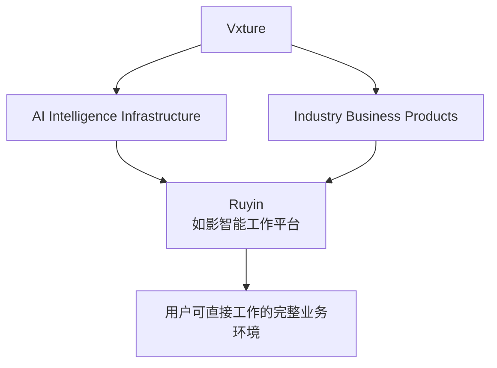

---

## 1.4 近期产品定位

近期首先解决：

> **Vxture 云端业务产品的本地化使用问题。**

让用户能够在本地工作环境中：

- 使用云端业务能力
- 接入本地文件
- 接入本地数据
- 接入局域网数据服务
- 根据安全策略决定数据是否上云
- 在不改变核心业务体验的情况下使用本地世界

### 第一阶段核心模型

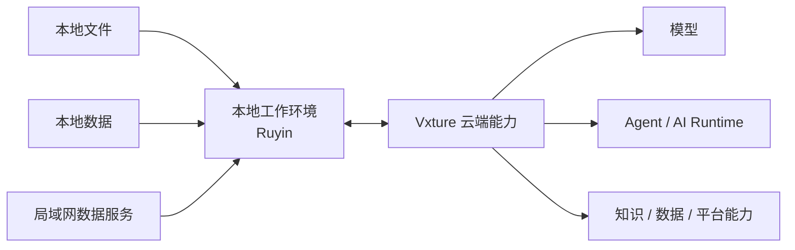

---

## 1.5 产品发展路径

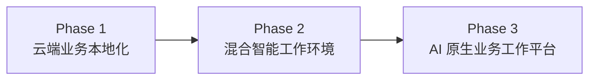

### Phase 1：Cloud-Connected Local Workspace

> 云端业务能力，本地可用。

### Phase 2：Hybrid Intelligence Workspace

> 云端能力与本地数据、工具、记忆和部分智能能力深度融合。

### Phase 3：AI-Native Business Work Platform

> 如影成为行业级 AI 原生业务工作平台。

---

# 2. Product Positioning

## 2.1 Ruyin 是什么

Ruyin 是 Vxture 面向行业业务场景构建的 AI 原生工作平台。

它位于：

```text
Vxture 底层智能基础设施
          ↓
      Ruyin
          ↓
用户真实业务工作
```

Ruyin 负责将 Vxture 的能力：

- 组织
- 组合
- 调用
- 连接
- 呈现

最终形成用户可以直接工作的业务环境。

---

## 2.2 核心价值链

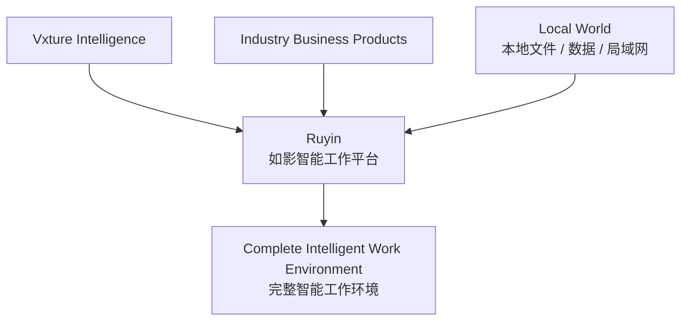

核心价值：

> **云端能力、本地数据与行业业务，在一个统一工作环境中协同。**

---

## 2.3 Ruyin 不是什么

Ruyin 不是：

- ❌ 单纯的 AI Chat 客户端
- ❌ Agent Marketplace
- ❌ 个人知识库
- ❌ 个人文件管理器
- ❌ Vxture SaaS 产品的简单桌面镜像
- ❌ 多个 SaaS 产品的简单集合
- ❌ 以 Agent 替代完整业务系统

---

## 2.4 核心产品定义

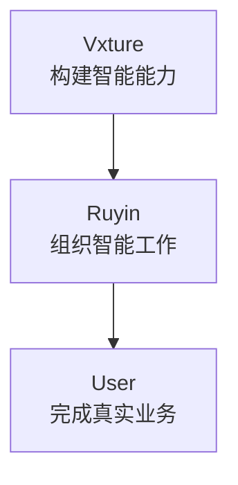

> **Vxture 构建智能能力，如影组织智能工作。**

英文表达：

> **Vxture builds intelligence. Ruyin organizes intelligent work.**

---

# 3. Industry Product Strategy

## 3.1 行业级产品方向

Ruyin 的长期产品组织方式趋向于“大行业”，而不是单一工具。

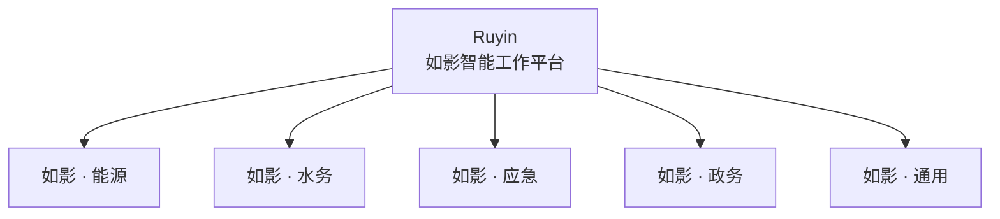

---

## 3.2 行业不是主题皮肤

行业产品不应只是：

- Logo 不同
- 颜色不同
- 首页不同

而应该包含完整的行业业务体系：

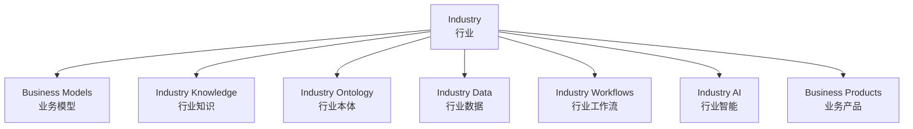

---

## 3.3 行业与业务产品

例如：

```text
如影 · 能源
│
├── 客户关系管理
├── 项目投标
├── 能源数据分析
├── 经营分析
└── AI 决策
```

```text
如影 · 水务
│
├── 水务项目管理
├── 水情分析
├── 应急处置
├── 客户管理
└── 经营分析
```

```text
如影 · 应急
│
├── 事件管理
├── 轨迹分析
├── 指挥调度
├── 预案管理
└── 复盘分析
```

---

# 4. Product Philosophy

## 4.1 业务优先，而不是 AI 优先

用户不是为了使用 AI 而进入 Ruyin。

用户是为了：

- 管理客户
- 推进销售
- 编写标书
- 分析轨迹
- 处理应急事件
- 完成项目
- 经营企业

而进入 Ruyin。

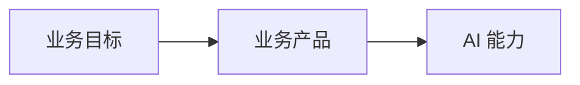

核心原则：

> **AI 服务于业务目标。**

---

## 4.2 AI 是业务智能层

AI 不一定必须以 Agent 的形式出现。

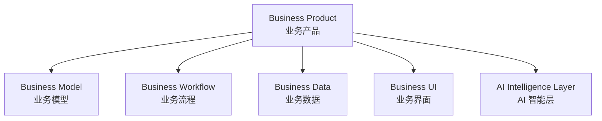

AI 可以以不同方式存在：

| AI 形态 | 说明 |
|---|---|
| 显式交互 | 用户主动请求 AI 分析、生成和建议 |
| 隐式智能 | AI 在后台分析业务数据 |
| 主动智能 | AI 根据业务状态主动提醒 |
| 自动智能 | AI 在授权范围内自动执行部分业务流程 |

> **Agent 是实现方式，不是产品本质。**

---

## 4.3 业务产品不应被 Agent 化

错误模型：

```text
Agent
  ↓
替代 CRM
```

正确模型：

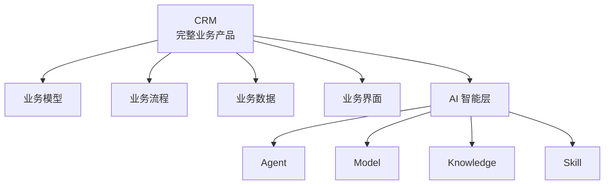

CRM 仍然是 CRM。

AI 是 CRM 的智能层。

---

## 4.4 Vxture 构建智能能力，Ruyin 组织智能工作

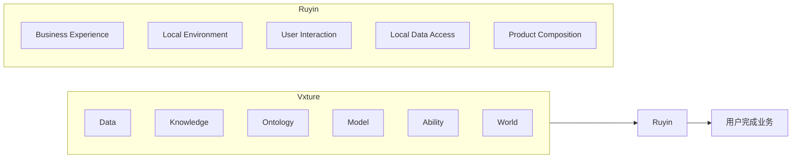

---

## 4.5 数据来源与数据存储分离

这是 Ruyin 的重要基础原则。

### 数据来源

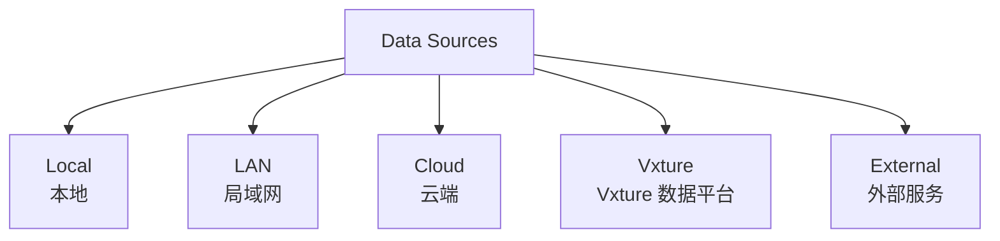

### 数据存储

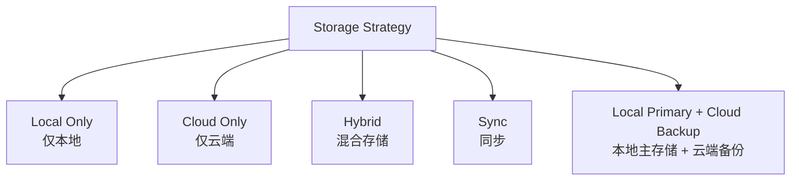

> **数据来源与数据最终存储位置不是同一个问题。**

---

# 5. Top-Level Product Architecture

## 5.1 总体逻辑分层

Ruyin 的初步顶层结构：

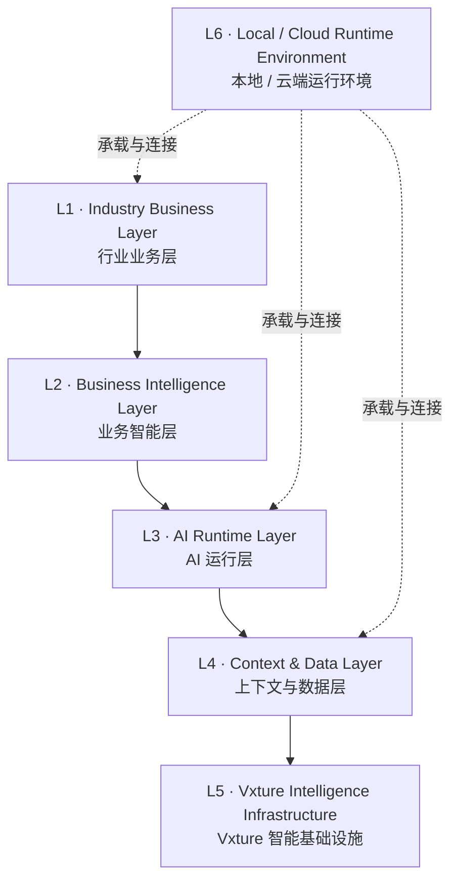

---

## 5.2 逻辑分层说明

### L1 · Industry Business Layer

面向用户的行业业务产品。

例如：

- CRM
- 标书编写
- 轨迹分析
- 应急指挥
- 经营分析

这一层决定：

> 用户要完成什么业务。

---

### L2 · Business Intelligence Layer

业务智能层。

包括：

- 业务分析
- 业务推荐
- 业务预测
- 业务决策
- 业务自动化

这一层决定：

> AI 如何理解并增强具体业务。

---

### L3 · AI Runtime Layer

AI 能力运行层。

包括：

- Agent
- Model
- Skill / Ability
- Workflow
- Planning
- Tool Calling
- Task Execution

这一层决定：

> AI 如何执行智能任务。

---

### L4 · Context & Data Layer

上下文与数据层。

包括：

- 本地文件
- 本地数据
- 局域网数据
- Vxture 数据平台
- 知识库
- 业务记忆
- 行业本体
- 业务语义

这一层决定：

> AI 和业务使用什么上下文。

---

### L5 · Vxture Intelligence Infrastructure

Vxture 底层智能基础设施。

初步产品映射：

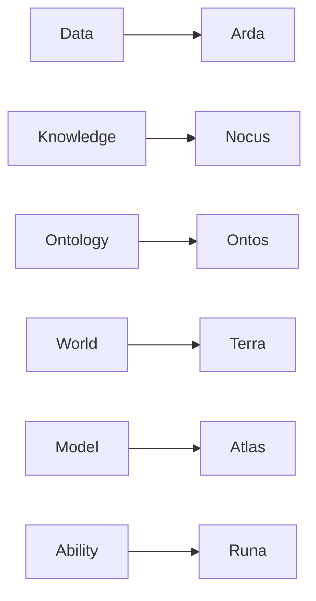

---

### L6 · Local / Cloud Runtime Environment

Ruyin 的运行环境。

包括：

- Local Runtime
- Cloud Runtime
- Private Network
- Hybrid Runtime

长期目标：

> 同一业务产品能够根据实际环境运行在 Cloud、Local、Private Network 或 Hybrid 环境中。

---

# 6. Business Product Model

## 6.1 不同业务拥有不同业务内核

Ruyin 不以统一的 Project 作为所有业务的顶层容器。

不同业务拥有不同的组织方式。

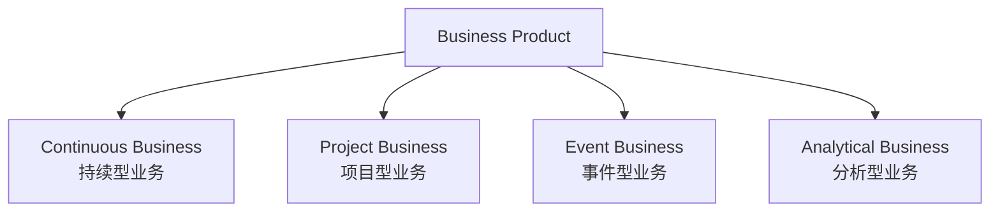

---

## 6.2 CRM：持续型业务系统

CRM 的核心不是 Project，而是客户生命周期。

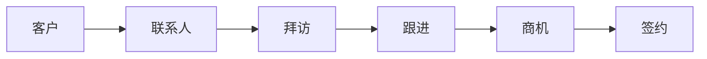

CRM 的核心业务对象：

- 客户
- 联系人
- 拜访
- 沟通与跟进
- 商机
- 合同
- 客户分析
- 销售计划

AI 可以作为 CRM 的智能层：

- 客户分析
- 跟进问题识别
- 商机预测
- 销售建议
- 销售教练
- 自动提醒

---

## 6.3 标书编写：项目型业务系统

标书编写的核心组织结构是 Project。

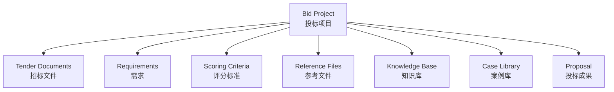

一个投标项目结束后：

```text
投标项目
   ↓
项目结束
   ↓
资料沉淀
   ↓
案例 / 知识资产
```

---

## 6.4 Business Product 通用模型

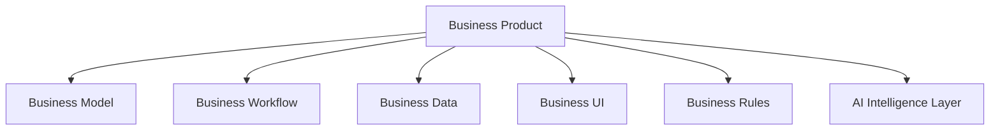

---

# 7. Local / Cloud Product Model

## 7.1 第一阶段：Cloud-Connected Local Workspace

Ruyin 作为本地工作环境：

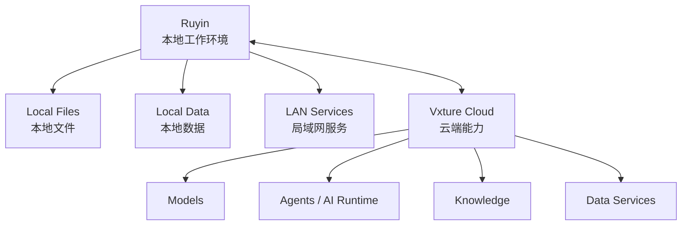

第一阶段重点：

- 本地文件访问
- 本地数据连接
- 局域网数据连接
- 云端模型调用
- 云端 Agent 能力
- 本地安全策略
- 必要的本地缓存

---

## 7.2 三类基本数据模式

### 模式一：云端数据

```mermaid
flowchart LR
    R["Ruyin"] --> CD["Vxture Cloud Data"]
    CD --> AI["Cloud AI"]
```

---

### 模式二：本地数据 + 云端能力

```mermaid
flowchart LR
    LD["Local Data"]
    R["Ruyin"]
    AI["Cloud AI"]

    LD --> R --> AI
```

---

### 模式三：未来的完全本地能力

```mermaid
flowchart LR
    LD["Local Data"]
    R["Ruyin"]
    LM["Local Model / Local Service"]

    LD --> R --> LM
```

> 完全本地不是第一阶段核心目标，而是长期能力演进方向。

---

## 7.3 长期 Cloud / Local 对等模型

```mermaid
flowchart TB
    UX["Unified Business Experience<br/>统一业务体验"]

    UX --> C["Cloud Runtime"]
    UX --> L["Local Runtime"]
    UX --> P["Private Runtime"]
    UX --> H["Hybrid Runtime"]
```

目标：

> **体验统一，能力逐步演进。**

而不是：

> 第一阶段就复制整个 Vxture 到本地。

---

# 8. Product Evolution Roadmap

## Phase 1 · 云端业务本地化

### 目标

> 让 Vxture 云端业务产品可以在本地工作环境中使用。

```mermaid
flowchart LR
    V["Vxture Cloud"]
    R["Ruyin Local"]
    U["User"]

    V <--> R --> U
```

重点：

- 本地文件
- 本地数据
- 局域网连接器
- 云端模型
- 云端业务能力

---

## Phase 2 · 混合智能工作环境

### 目标

> 本地数据、记忆、索引、工具和部分智能能力与云端能力深度协同。

```mermaid
flowchart LR
    L["Local Intelligence"]
    C["Cloud Intelligence"]

    L <--> H["Hybrid AI Runtime"] <--> C
```

---

## Phase 3 · AI 原生业务工作平台

### 目标

> 以行业为组织方式，形成完整的 AI 原生业务工作环境。

```mermaid
flowchart TB
    R["Ruyin"]

    R --> E["如影 · 能源"]
    R --> W["如影 · 水务"]
    R --> EM["如影 · 应急"]
    R --> G["如影 · 政务"]
    R --> X["如影 · 通用"]
```

---

# 9. Current Decisions & Open Questions

## 9.1 已确定

- Ruyin 的远期定位是 Vxture 的 AI 原生业务工作平台。
- 近期重点是解决云端业务产品的本地化问题。
- Ruyin 负责组织 Vxture 能力与行业业务产品，形成完整工作环境。
- 业务产品优先，AI 是业务智能层。
- 业务产品不应简单 Agent 化。
- 本地数据可以调用云端能力。
- 数据是否上云由数据策略决定。
- 数据来源与数据存储需要分离设计。
- 长期目标是 Cloud Runtime 与 Local Runtime 的体验和能力趋于对等。
- 第一阶段不追求本地复制完整 Vxture。

---

## 9.2 当前建议

- 以行业作为长期产品组织和品牌化方向。
- 以 Business Product 作为 Ruyin 的核心业务对象。
- 不同业务采用不同内部组织模型。
- CRM 可以是持续型业务系统。
- 标书编写可以是 Project 型业务系统。
- 第一阶段优先建立 Cloud-Connected Local Workspace。
- Ruyin 作为 Vxture 能力到用户业务之间的最后一公里。

---

## 9.3 待继续讨论

- Ruyin 的行业—业务产品—工作空间三层关系。
- 用户打开 Ruyin 后的第一屏和顶层导航模型。
- 订阅产品与 Ruyin 内部业务产品的映射关系。
- 行业产品与通用业务产品的边界。
- Ruyin Local Runtime 的最小能力边界。
- 数据、文件、连接器与云端能力的安全策略。
- 业务产品与 Vxture L1/L2 能力的标准调用模型。

---

# 10. Guiding Principles

1. **先解决真实业务，再讨论 AI 形态。**
2. **先加强云端业务能力，再逐步增强私域与本地能力。**
3. **本地化不是复制云端，而是让云端业务能够安全使用本地世界。**
4. **业务模型长期稳定，AI 能力持续演进。**
5. **数据来源与数据存储分离。**
6. **Agent 是业务智能的实现机制之一，不是业务产品的替代品。**
7. **Ruyin 负责组织智能工作，Vxture 负责提供智能能力。**
8. **不确定的产品决策保持开放，避免过早固化。**

---

# 11. 下一步设计重点

下一阶段建议重点研究：

> **Ruyin 的“行业—业务产品—工作空间”三层关系。**

需要回答：

```text
用户打开 Ruyin
      ↓
进入什么？
      ↓
选择行业？
      ↓
选择业务产品？
      ↓
进入业务工作环境？
      ↓
如何组织具体工作？
```

核心问题：

> **Ruyin 的第一屏到底应该是“行业入口”、 “已订阅业务”、还是“当前工作”？**

这个问题将直接决定：

- 顶层导航
- 产品容器模型
- 订阅产品映射
- 行业与业务关系
- 用户的核心工作路径

---

> **本文档为 Ruyin 产品战略与顶层设计 v0.1，后续持续演进。**
