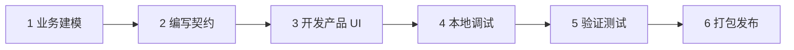

# 如影 Product Integration Guide：业务产品接入指南

> **Ruyin Product Integration Guide**
>
> 文档编号：07  
> 文档版本：v0.1  
> 文档状态：架构设计基线（SDK 细节随 Phase A 实现校准）  
> 所属平台：Vxture Platform  
> 关联文档：02（v0.3）、03（v0.3）、03-A（v0.1）、04（v0.1）、05（v0.1）、06（v0.1）  
> 读者：Vxture 业务产品团队（未来扩展到第三方 publisher）

---

# 1. 文档定位

前六份文档面向架构；本文件面向**接入者**：

> **一个 Vxture 业务产品团队，如何让自己的产品在 Ruyin（本地）与 Cloud Runtime（云端）中运行。**

核心心智：

```text
接入 ≠ 移植
接入 = 声明
```

你不需要为 Ruyin 重写产品逻辑。你需要：

1. 用契约**声明**你的业务（对象 / 状态 / 上下文 / 能力 / 任务）
2. 提供一份 **Web UI bundle**（同一份，云端浏览器与本地沙箱通用）
3. 打包、签名、发布到 Registry

其余（工作空间、上下文获取、AI 调用、权限、审计、同步）由 Runtime 统一提供 —— 你声明"要什么"，Runtime 负责"怎么给"。

---

# 2. 接入总览



| 步骤 | 产出 | 校验 |
|---|---|---|
| 业务建模 | 对象 / 状态 / 工作空间类型草案 | 设计评审 |
| 编写契约 | `ruyin.product.yaml` | 契约 lint（R 系列，03-A §15） |
| 产品 UI | Web bundle（经 SDK 访问 Runtime） | 沙箱内可运行 |
| 本地调试 | 可跑通的开发包 | `ruyin dev` 加载（**尚未落地**；今天用守护进程的 `RUYIN_PRODUCTS_DIR` 开发目录） |
| 验证测试 | 双运行时冒烟 + 验证规则测试 | 检查清单（§12） |
| 打包发布 | `.ruyinpkg` + 双签 | Registry 审核（R12） |

---

# 3. 前置概念速览

接入前必须理解的六个概念（详见括号内文档）：

| 概念 | 一句话 | 详见 |
|---|---|---|
| Workspace | 你的产品的工作边界：数据 / 权限 / AI 上下文 / 状态 / 同步都以它为界 | 02 §6 |
| Runtime Contract | 你的产品与 Runtime 之间的全部约定，一个 YAML 文件 | 03-A |
| Context Type | 你声明"需要什么数据类型"；用户决定数据在哪、AI 能看多少 | 04 §2 |
| Task Definition | 你声明任务模板；运行期实例化、执行、验证由 Harness 负责 | 05 §4 |
| Tool Gate / Checkpoint | 每次工具调用过闸；关键节点等用户确认，你不能绕过 | 05 §5/§6 |
| Sync Policy | 你声明建议值；**数据是否上云永远由用户决定** | 04 §8 |

---

# 4. Step 1 · 业务建模

## 4.1 先回答三个问题

```text
1. 用户在你的产品里的工作边界是什么？
   → 决定 Workspace Type（persistent / project / document）

2. 你的业务由哪些对象构成、主对象是谁？
   → 决定 objects 与状态机挂载点

3. 完成业务需要哪些数据、各自多敏感？
   → 决定 context.types 与 sensitivity
```

## 4.2 Workspace Type 选择指引

| 你的业务像… | 选 | 例 |
|---|---|---|
| 长期经营、无自然终点 | persistent | CRM 销售空间 |
| 有始有终、结束后沉淀 | project | 投标项目 |
| 围绕文档与版本 | document | 文档编写 |

**不要**把持续型业务硬套成 project（01 §6.1 的教训：不同业务有不同内核）。

## 4.3 建模守则

- 对象建模照搬你的业务领域模型，不为 AI 改造业务（AI 是智能层，02 Principle 3）
- 状态机只放**业务事实**状态（草稿/评审/已提交），不放执行细节（执行状态归 Harness）
- 关键状态转换（提交、归档）标 `confirm: human`

---

# 5. Step 2 · 编写契约

完整字段规范见 03-A；本节是接入者视角的写法要点与常见错误。

## 5.1 最小起步

从 03-A §16 的 Bid 完整示例复制起步，逐段替换。声明顺序建议按依赖方向：

```text
objects → states → context.types → capabilities → tools → tasks
（tasks 引用前面全部，最后写）
```

## 5.2 常见 lint 错误对照

| 错误 | 违反 | 修正 |
|---|---|---|
| task 引用了未声明的 context type | R8 | 先在 context.types 声明，含 class 与 sensitivity |
| 任务输出类型 class 写成 source | R8 | 输出必须是 generated / derived |
| 生成类任务没有 human 验证 | R9 | 至少加一条 `kind: human` |
| capability 里写了模型名 | R6 | 只写能力语义，模型由 Resolver 决定 |
| 高危工具默认 allow | R7 | high 风险最多 ask |
| permissions 想默认放开同步 | R10 | 不可能；同步永远用户决定 |

## 5.3 诚实声明原则

- **sensitivity 按最坏内容标**：招标文件可能含商业机密 → high。标低了会绕过用户确认，属于破坏用户信任的缺陷
- **context 声明最小集**：只声明任务真正需要的类型。声明越多，用户授权负担越重、产品越难被信任
- **constraints 写给 AI 也写给审计**：如"不得虚构企业能力"会进入任务执行与成果 Provenance 核查

---

## 5.4 云端能力面与 Runos（ADR-009 / ADR-020，2026-09-05）

契约之外，产品还要出**一个云端服务**：能力面。Ruyin 不直连 Atlas、不直连 Runos
（ADR-001 / ADR-009）—— 桌面客户端是零秘密的 public client，换不到 S2S 令牌；持
confidential 凭据、替用户换票、调 Atlas 与 Runos 的，是产品自己的云端。

| 义务 | 内容 | 出处 |
|---|---|---|
| 回合端点 | `POST /capabilities/:id/turn`：收 `{objective, constraints, context[], messages[], tools[], skills[], revision?}`，回 `tool_calls | content | verdict`。运行时只给事实，措辞归产品 | 30-design/20；ADR-011 |
| 模型 | 用服务端会话里的用户 access token 做 OBO 换票（`act.sub` = 产品码），调 Atlas `POST /v1/chat`，每次必带 `taskId` | ADR-001；《产品接入范本》 |
| Runos 能力 | 同一张 OBO 票调 Runos `POST /v1/mcp`（`aud=runos`、`scope=tool:runos`），四工具流 discover → resolve → invoke → report_outcome；`_meta.vxture.task_id` 与本地任务的 `taskId` 用**同一个值** —— 两边审计靠它对账 | ADR-020 §2 / §3 |
| **技能目录转发** | 能力面把 Runos 分发给本产品的 Skill（`runos_invoke` 的 `fetch`，返回 `SKILL.md` 全文 + 资源块 + `content_digest`）**转交给 Ruyin**：暴露 `GET /skills`（目录：`name`、`description`、`capability_id@version`、`content_digest`）与 `GET /skills/:name`（全文与资源）。Ruyin 把它们进本机技能登记册的**产品分发层**，按 digest 缓存、离线可用 | ADR-020 §3 c / §6-1 |
| 第三方密钥 | **不经过 Ruyin，也不经过能力面的代码**：注册进 Runos 的凭证保险库，由 Runos 在出站调用时注入。产品侧只声明 `credential_requirements` | ADR-020 §6-2 |
| 脚本 | 带 `scripts/` 的技能：本地不跑（TD-005）；不带业务数据的脚本可声明依赖 Runos Executor 在云端沙箱里跑 —— **登记未启用** | TD-005；ADR-020 §6-3 |

**平台侧前提（2026-09-05 读平台代码核实）**：平台 token-exchange 的 `resolveOboContext` 只接受
`aud` 等于 caller 自己 client id 的 subject_token；Ruyin 登录得到的用户 token `aud='ruyin'`，
产品云端拿它去换票会被 `400 invalid_request` 拒掉。这是「桌面客户端 + 产品云端」形态第一次
撞上单受众纪律，解法（Ruyin 按产品申请受众 RFC 8707 `resource`，或平台侧受托登记）与 bid
的登记一起提在 vxture-platform/vxture-platform#198。**不定，任何产品的云端能力面在生产上都通不了。**

**第一个消费者。** Runos 至今按「baseline-only until first consumer」运行（Runos
ADR-014）。owner 2026-09-05 定：**bid 产品的云端能力面是 Runos 的第一个消费者**。
也就是说 bid 的云端要先于任何别的产品把上表跑通 —— 它同时是本指南这一节的活体样本。

# 6. Step 3 · 产品 UI 开发

## 6.1 运行环境

同一份 Web bundle，两个宿主：

```text
Cloud Runtime  → 浏览器标签页
Local Runtime  → 沙箱 iframe（独立 origin + CSP + sandbox 属性）
```

约束（06 §8.2）：

- 无直接文件系统访问、无任意外部网络（CSP 白名单）、无 Node API
- 一切能力经 SDK → 桥接层 → Local API，桥按你的契约裁剪 —— **UI 越不过 Tool Gate**

## 6.2 SDK 概貌

`@ruyin/product-sdk`（TypeScript，API 面随 Phase A 冻结）：

```typescript
import { connect } from "@ruyin/product-sdk";

const ruyin = await connect();               // 桥握手，取得契约裁剪后的能力面

// —— 工作空间与业务对象 ——
const ws = ruyin.workspace;                  // 当前 Workspace 信息与业务状态
const projects = await ruyin.objects.list("bid_project");
await ruyin.objects.update("bid_project", id, patch);   // 仅契约内对象

// —— 业务状态机 ——
await ruyin.state.transition("review");      // confirm: human 的转换会走 Checkpoint

// —— 任务 ——
const task = await ruyin.tasks.start("generate_proposal", {
  inputs: { tender_document: [itemRef] },
});
task.on("state", s => render(s));            // 05 §3 状态机的实时投影
task.on("progress", p => renderProgress(p));

// —— Checkpoint（呈现由 Workspace UI 统一负责，产品可监听结果）——
ruyin.checkpoints.on("decided", cp => refresh(cp));

// —— 上下文可见性 ——
const bindings = await ruyin.context.bindings();   // 用户绑定情况（只读）
// 注意：产品 UI 不能读取 Item 内容，只能看到元数据与绑定状态

// —— 成果 ——
const results = await ruyin.results.list(task.id);  // 含 Verification 与 Provenance
```

## 6.3 UI 责任划分

| 归产品 UI | 归 Workspace UI（Runtime 统一） |
|---|---|
| 业务界面（03 §21：统一的是运行时，不是界面） | Checkpoint 呈现与决策 |
| 任务发起与业务进度展示 | Context Set 确认、文件 Grant 授权 |
| 业务对象的增删改查交互 | 同步与冲突界面、审计查看 |
| 成果展示与业务操作 | 登录 / 订阅 / 设置 |

> **凡涉及用户对 AI 与数据的控制权的界面，一律由 Runtime 统一提供** ——
> 保证控制体验在所有产品中一致，也防止产品自绘假确认框。

---

# 7. Step 4 · 本地开发与调试

开发者工作流（`ruyin lint` 随 Phase A 交付；`ruyin pack` / `ruyin registry` 2026-09-03 交付；
**`ruyin dev` 尚未落地** —— 下面这段是目标态，不是现状）：

```text
ruyin dev ./my-product/
    ├── 加载未打包目录（跳过签名，标记开发模式水印）
    ├── 契约热校验：保存即重跑全部 R 规则，错误指明字段路径
    ├── UI 热更新
    ├── AI 能力模拟：capabilities 可挂 mock 响应（无需真实云端）
    └── Checkpoint / 验证流程可单步触发
```

开发模式限制：

- 开发包不能安装到正式 Runtime（无签名）
- mock 模式下审计事件照常产生并标记 `dev`，用于调试审计链

---

# 8. Step 5 · 验证测试

## 8.1 契约层

```text
ruyin lint ./my-product/        # R 系列静态检查（发布前 Registry 会重跑）
```

## 8.2 行为层

必测项（对照 05）：

| 场景 | 期望 |
|---|---|
| required 上下文未绑定时启动任务 | 任务不启动，明确报缺失项（04 §6.3） |
| high sensitivity 上下文进入任务 | 出现 context_confirm Checkpoint |
| 验证不通过 | 修订轮 → 上限后交人，不静默丢弃 |
| 任务中途杀掉 Runtime 再启动 | 从断点恢复，副作用不重复（05 §8.3） |
| confirm: human 状态转换 | 必然经 Checkpoint |

## 8.3 双运行时冒烟

同一包在 Cloud Runtime 与 Local Runtime 各跑一遍核心任务流：

- 状态序列、Checkpoint 触发点、审计事件种类一致（C1–C4）
- 差异仅应出现在数据面（如 local-only 绑定的任务在云端不可启动 —— 这是预期行为，03-A §17）

---

# 9. Step 6 · 打包与发布

```text
ruyin pack ./my-product/          → my-product-1.0.0.ruyinpkg（含 CHECKSUMS；2026-09-03 起可用，暂无 SIGNATURE，见 TD-037）
ruyin registry ./products/ --out ./registry --base-url https://dl.vxture.com/ruyin/products
                                  → 静态产品库：每个产品一个包 + index.json + SHA256SUMS
ruyin sign --key <publisher-key>  → 附加发布者签名
ruyin publish --registry vxture   → 提交 Registry
    ├── Registry 重跑 lint + 验签
    ├── 平台审核（第三方 publisher 必经；内部产品走快速通道）
    └── 平台副署 → 上架
```

发布后：

- 订阅配置（Entitlement）由 Vxture 平台侧完成，产品团队不直接面对
- 版本升级遵守 03-A §18.4：**minor 只增不删** —— 删除对象/类型会孤立用户既有数据，Registry 会拒绝违规的 minor 版本

---

# 10. 设计守则（Do / Don't）

## Do

1. **业务优先**：先把业务产品做完整，AI 作为智能层进入（02 Principle 1/3）
2. **最小上下文**：任务只声明必要的 input_types
3. **敏感度诚实**：按最坏内容标 sensitivity
4. **验证当真**：verification 是你产品质量的声明，不是过场；生成物必有 human 一环
5. **状态即事实**：业务状态机反映真实业务里程碑，让 AI、用户、云端都能读懂进度

## Don't

1. ❌ 绑定模型 / Provider（R6 会拦，别试）
2. ❌ 在 UI 里自绘确认框替代 Checkpoint（桥不提供绕行 API，且属审核否决项）
3. ❌ 用 `external` 来源偷连自有服务端（CSP + 审核双重拦截；正路是声明 cloud 上下文或 MCP 连接器）
4. ❌ 把执行细节塞进业务状态机（执行状态归 Harness）
5. ❌ 申请用不到的工具与权限（审核会问用途，用户会看到并不信任）

---

# 11. FAQ

**Q：为什么我的任务在云端 Runtime 不可启动？**
A：它依赖的 required 上下文只有本地绑定（如用户未同步的本地文件）。这是数据面差异的预期行为，不是缺陷（03-A §17）。UI 应展示"该任务需要在本地环境执行或同步相关数据"。

**Q：为什么 export / 对外发送每次都弹确认？**
A：硬底线（05 §5.1），产品与用户策略都不能关闭。请在交互设计上把它当成流程的一部分而不是打扰。

**Q：我能拿到用户的文件内容做产品自己的处理吗？**
A：UI 层不能（只能见元数据）。处理文件内容的唯一途径是声明 task + tools，在 Harness 内经 Tool Gate 执行 —— 这保证一切处理留痕可审计。

**Q：AI 生成结果我能直接写回业务对象吗？**
A：能，但必须经任务的 verification 链；含 human 验证的结果在用户确认前处于 pending 状态。

**Q：我的产品需要跑自定义分析脚本怎么办？**
A：当前契约不开放 `execute_script` 类工具（06 §13：执行沙箱就位前不得进入 schema）。先用声明式工具组合表达；确有刚需请向平台提出，推动执行沙箱专项。

---

# 12. 发布前检查清单

```text
□ ruyin lint 零错误（全部 R 规则）
□ Workspace Type 与业务形态匹配（§4.2）
□ 所有 generated 输出的任务含 human 验证
□ sensitivity 标注经产品与安全双确认
□ §8.2 行为层五场景全部通过
□ 双运行时冒烟通过，差异仅在数据面
□ minor 升级未删除任何已有声明
□ UI 在沙箱 CSP 下无违规请求
□ 无自绘确认 / 权限类界面
□ 发布者签名密钥按规程保管
```

---

# 13. Open Questions

- SDK API 面的正式规范（随 Phase A 桥接层实现冻结，本文 §6.2 为设计基线）
- 产品 UI 与 Workspace UI 的视觉协调规范（设计系统 token 是否下发给产品）
- 第三方 publisher 的审核标准细则与 SLA
- 产品间协作场景（如 CRM 商机 → 发起投标项目）的跨产品接口 —— 当前明确不支持（03 §33 排除跨产品 Workspace），需求积累后立项

---

# Final

> **接入一句话：声明你的业务，带上你的界面；数据怎么来、AI 怎么调、用户怎么控，Runtime 替你管，而且不许你自己管。**
